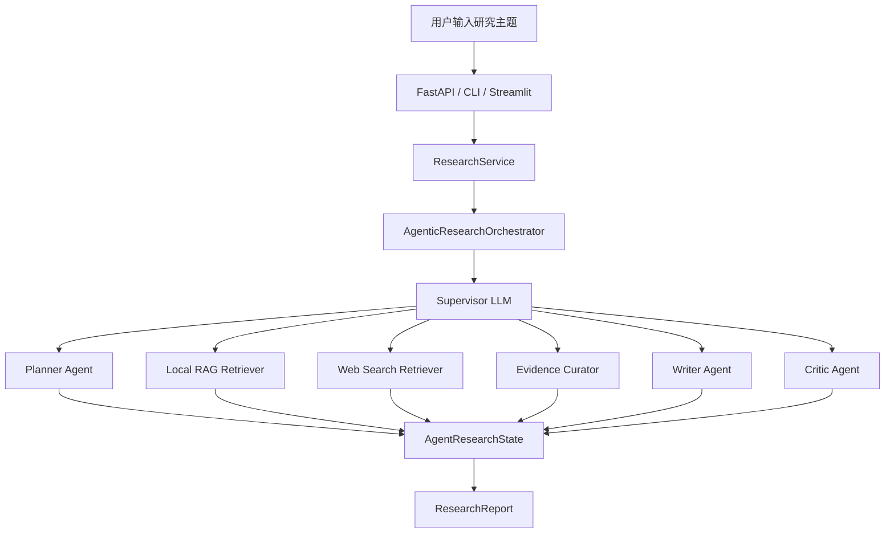
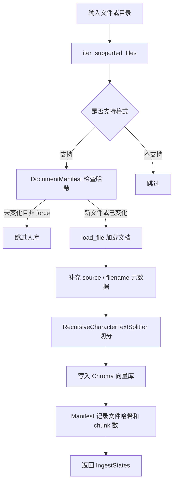
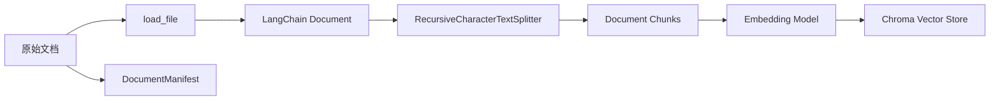
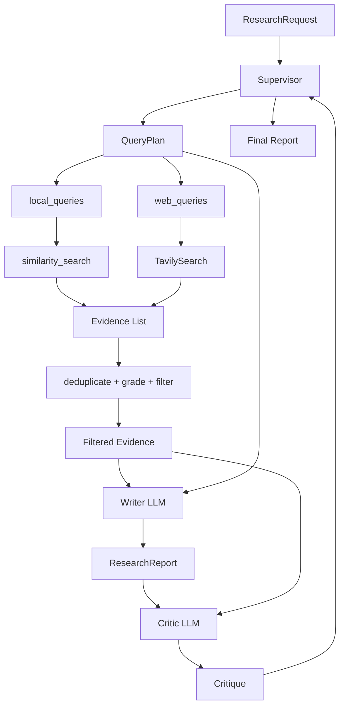

# 基于 LangChain 的多智能体 RAG 研究报告生成系统说明与面试准备

本文档用于系统梳理当前项目的实现流程、数据流向、LLM 调用细节、约束机制、工程边界，以及将该项目写进简历后可能被面试官追问的问题与回答思路。

## 1. 项目定位

本项目不是传统的“单轮知识库问答 RAG”，而是一个面向复杂主题研究的 RAG + Multi-Agent 研究报告生成系统。

用户输入一个研究主题后，系统会自动完成：

1. 研究任务规划。
2. 本地私有知识库检索。
3. 可选的公开网页检索。
4. 证据去重、评分与筛选。
5. 基于证据生成 Markdown 研究报告。
6. 对报告进行质量评审。
7. 输出报告、证据、质检结果和 Agent Trace。

项目提供三种使用入口：

- `FastAPI`：提供 `/research` 与 `/ingest` HTTP 接口。
- `Typer CLI`：支持命令行查看配置、文档入库、执行研究任务。
- `Streamlit UI`：提供知识库入库、研究任务提交、证据与 Agent Trace 展示。

核心代码模块：

| 模块 | 作用 |
| --- | --- |
| `agents/supervisor.py` | 多智能体调度核心，负责规划、检索、证据筛选、写作、质检等流程编排 |
| `agents/prompts.py` | Planner、Writer、Critic 的系统提示词 |
| `ingestion/` | 文档加载、切分、入库流程 |
| `retrieval/` | 本地向量检索、网页检索、证据治理 |
| `storage/manifest.py` | 文档哈希 Manifest，支持增量入库 |
| `models.py` | Pydantic 数据模型，定义请求、计划、证据、报告、质检结果等结构 |
| `api/main.py` | FastAPI 接口 |
| `ui/streamlit_app.py` | Streamlit 可视化界面 |
| `__main__.py` | Typer 命令行入口 |

## 2. 总体架构

系统可以拆成四层：

1. 接入层：API、CLI、Streamlit。
2. 服务层：`ResearchService` 统一封装研究任务执行。
3. 智能体编排层：`AgenticResearchOrchestrator` 管理任务状态、调用 LLM 和各类工具。
4. 数据与检索层：文档入库、向量库、网页检索、证据治理。



## 3. 核心数据模型

项目通过 `models.py` 使用 Pydantic 约束系统中的关键数据结构。

### 3.1 ResearchRequest

用户请求结构：

```python
class ResearchRequest(BaseModel):
    topic: str
    depth: ResearchDepth
    report_format: ReportFormat
    language: Literal["zh", "en"]
    require_web: bool
    allowed_domains: list[str]
    blacklist: list[str]
```

作用：

- `topic`：研究主题。
- `depth`：报告深度，支持 `brief`、`detailed`、`deep`。
- `report_format`：报告格式，支持 `markdown`、`academic`、`executive`。
- `require_web`：是否允许网页检索。
- `allowed_domains`、`blacklist`：预留的域名过滤字段，当前版本模型里已定义，但网页检索阶段还没有完整应用。

### 3.2 QueryPlan

规划智能体生成的结构化研究计划：

```python
class QueryPlan(BaseModel):
    title: str
    intent: str
    research_questions: list[str]
    local_queries: list[str]
    web_queries: list[str]
    expected_sections: list[str]
    risk_notes: list[str]
```

作用：

- 把用户主题拆成可检索、可验证、可写作的子问题。
- 为本地知识库和网页检索分别生成查询词。
- 约束报告应该包含哪些章节。
- 对医疗、法律、金融、安全、政策、实时事件等高风险主题记录风险提示。

### 3.3 Evidence

检索结果统一封装为 Evidence：

```python
class Evidence(BaseModel):
    id: str
    source_type: SourceType
    title: str
    content: str
    url: str | None
    source: str | None
    author: str | None
    published_at: str | None
    retrieved_at: datetime
    score: float
    metadata: dict[str, Any]
```

作用：

- 将本地知识库结果和网页搜索结果统一成同一种证据对象。
- `source_type` 区分本地、网页、学术、用户输入等来源。
- `score` 用于后续证据排序。
- `metadata` 保留 chunk 信息、文件来源、查询词等上下文。

### 3.4 ResearchReport

最终输出：

```python
class ResearchReport(BaseModel):
    title: str
    executive_summary: str
    report_markdown: str
    claims: list[Claim]
    evidence: list[Evidence]
    agent_trace: list[dict[str, Any]]
    critique: Critique | None
    generated_at: datetime
```

报告不仅包含 Markdown 文本，还包含：

- 证据列表。
- 可机器识别的 Claim。
- Agent 执行轨迹。
- 质检结果。

这使它不是一个简单文本生成器，而是一个带过程记录和证据链的研究工作流。

## 4. 文档入库流程

入口：

- CLI：`python -m RAG_multiagent ingest <path>`
- API：`POST /ingest`
- Streamlit：侧边栏填写入库目录并点击 `Ingest documents`

入库主流程在 `ingestion/pipeline.py`：



### 4.1 支持的文件格式

`ingestion/loaders.py` 支持：

- `.txt`
- `.md`
- `.markdown`
- `.pdf`
- `.docx`
- `.html`
- `.htm`

加载方式：

- PDF：`PyPDFLoader`
- DOCX：`Docx2txtLoader`
- HTML：`BeautifulSoup` 抽取正文文本
- TXT / Markdown：按 UTF-8 文本读取

### 4.2 文档切分

`ingestion/chunker.py` 使用 `RecursiveCharacterTextSplitter`。

关键参数：

- `CHUNK_SIZE`
- `CHUNK_OVERLAP`

设计意图：

- `chunk_size` 控制每个片段的最大长度，避免单个 chunk 太长导致召回不准或 prompt 超长。
- `chunk_overlap` 保留片段之间的上下文连续性，降低知识点被切断的概率。
- 分隔符优先按段落、换行、中文标点、英文句号、空格切分。

### 4.3 增量入库机制

`storage/manifest.py` 中的 `DocumentManifest` 用文件内容哈希判断文档是否发生变化。

流程：

1. 对文件按二进制块读取。
2. 计算 SHA-1 fingerprint。
3. 用文件绝对路径作为 key。
4. 如果当前 fingerprint 和 Manifest 中记录一致，则认为文件未变化。
5. 未变化且没有 `force=True` 时跳过入库。
6. 入库成功后记录 fingerprint 和 chunk 数。

说明：

- 当前实现中哈希算法是 SHA-1。
- Manifest JSON 字段名写的是 `sha256`，这是命名遗留问题，不影响功能，但面试时不要说成真正用了 SHA-256。

## 5. 研究任务执行流程

入口统一落到：

```python
ResearchService().run(request)
```

`ResearchService` 内部调用：

```python
AgenticResearchOrchestrator().run(request)
```

### 5.1 AgentResearchState

整个任务过程中，系统维护一个状态对象：

```python
@dataclass
class AgentResearchState:
    request: ResearchRequest
    plan: QueryPlan | None
    evidence: list[Evidence]
    graded_evidence: list[dict[str, Any]]
    report: ResearchReport | None
    critique: Critique | None
    errors: list[str]
    trace: list[dict[str, Any]]
```

它保存：

- 用户请求。
- 规划结果。
- 原始和筛选后的证据。
- 报告。
- 质检结果。
- 错误信息。
- 每一步 Agent 行为轨迹。

### 5.2 主循环

`AgenticResearchOrchestrator.run()` 中最多循环 9 步：

```python
for step in range(1, 10):
    decision = self._choose_next_tool(state, step)
    decision = self._apply_safety_guardrails(state, decision)
    self._record_decision(state, step, decision)

    if decision.action == "finish":
        break

    self._execute_decision(state, decision, step)
```

每一轮流程：

1. Supervisor LLM 判断下一步应该做什么。
2. 安全护栏检查这个决定是否满足前置条件。
3. 记录决策到 trace。
4. 执行动作。
5. 把执行结果写回 state。

可选动作：

| action | 含义 |
| --- | --- |
| `plan` | 生成研究计划 |
| `local_research` | 检索本地知识库 |
| `web_research` | 检索网页 |
| `grade_evidence` | 证据去重、评分、筛选 |
| `write_report` | 生成或重写报告 |
| `critique_report` | 质量评审 |
| `finish` | 结束任务 |

如果 9 步内没有生成报告，系统会调用 `_force_minimum_report()` 强制生成一份最低可交付报告。

## 6. 数据流向

### 6.1 入库数据流



关键数据变化：

1. 文件路径变成 `Document`。
2. `Document` 被切成多个 chunk。
3. 每个 chunk 带有 `source`、`filename`、`chunk_index` 等元数据。
4. chunk 进入 Chroma 向量库。
5. Manifest 记录文件 fingerprint，避免下次重复入库。

### 6.2 研究数据流



关键数据变化：

1. `ResearchRequest` 被 Planner 拆解成 `QueryPlan`。
2. `QueryPlan.local_queries` 用于本地向量库检索。
3. `QueryPlan.web_queries` 用于 Tavily 网页检索。
4. 检索结果统一封装成 `Evidence`。
5. Evidence 经过去重、可信度、时效性、相关性评分。
6. Writer 只基于筛选后的 Evidence 写报告。
7. Critic 检查报告是否回答研究问题、是否缺证据、是否存在 unsupported claims。
8. Supervisor 根据 Critic 结果决定结束、继续检索或重写。

## 7. 各个 LLM 收到的具体信息

项目中 LLM 主要承担四类角色：

1. Supervisor：决策下一步调用哪个专家能力。
2. Planner：生成结构化研究计划。
3. Writer：基于证据写报告。
4. Critic：对报告进行质量检查。

当前代码中这些角色都通过 `get_chat_model("dashscope")` 获取模型。实际模型配置来自环境变量，例如 `RA_CHAT_MODEL`、`DASHSCOPE_API_KEY`、`DASHSCOPE_BASE_URL`。

### 7.1 Supervisor LLM 收到的信息

位置：`agents/supervisor.py` 的 `_choose_next_tool()`。

Supervisor 的输入由两部分组成：

#### System Message

Supervisor 被定义为“研究型多智能体系统的主管智能体”。

核心要求：

- 必须通过工具调用来调度专家能力。
- 每一轮只选择一个最合适的工具。
- 不要机械执行固定流水线，要根据当前状态选择下一步。
- 没有计划时通常调用 `plan_research`。
- 证据不足时调用本地检索，必要且允许时再网页检索。
- 有新证据后通常先证据筛选，再写作。
- 有报告后应进入质量评审。
- 只有报告存在且质量可交付时才能 finish。

Supervisor 可调用的工具：

| 工具名 | 对应 action | 作用 |
| --- | --- | --- |
| `plan_research` | `plan` | 生成或重做研究计划 |
| `search_local_knowledge` | `local_research` | 检索本地知识库 |
| `search_web` | `web_research` | 检索公开网页资料 |
| `curate_evidence` | `grade_evidence` | 证据去重、评分、筛选 |
| `write_or_revise_report` | `write_report` | 写作或重写报告 |
| `critique_report` | `critique_report` | 检查报告质量 |
| `finish_research` | `finish` | 结束研究任务 |

#### Human Message

Supervisor 会收到以下具体信息：

1. 用户请求 JSON：

```json
{
  "topic": "用户研究主题",
  "depth": "detailed",
  "report_format": "markdown",
  "language": "zh",
  "require_web": true,
  "allowed_domains": [],
  "blacklist": []
}
```

2. 当前步数：

```text
当前步骤：step/10
```

3. 当前状态摘要 `_state_summary(state)`：

```json
{
  "has_plan": true,
  "plan": {
    "title": "...",
    "intent": "...",
    "research_questions": ["..."],
    "local_queries": ["..."],
    "web_queries": ["..."],
    "expected_sections": ["..."],
    "risk_notes": ["..."]
  },
  "evidence_count": 8,
  "graded_evidence_count": 8,
  "evidence_preview": [
    {
      "id": "L123",
      "type": "local",
      "title": "...",
      "score": 0.82
    }
  ],
  "report": {
    "title": "...",
    "chars": 3000,
    "claims": 5,
    "has_critique": true
  },
  "critique": {
    "passed": false,
    "quality_score": 0.72,
    "missing_evidence": ["..."],
    "unsupported_claims": ["..."],
    "next_queries": ["..."],
    "notes": "..."
  },
  "errors": ["最近错误"],
  "recent_trace": ["最近执行轨迹"]
}
```

4. 如果模型不支持工具调用，则要求返回 JSON 决策：

```json
{
  "action": "plan | local_research | web_research | grade_evidence | write_report | critique_report | finish",
  "rationale": "为什么选择这一步",
  "queries": ["如果需要检索，给出查询词"],
  "revision_instructions": "如果需要重写报告，给出修改要求",
  "confidence": 0.0
}
```

#### Supervisor 输出

优先输出工具调用。系统从工具调用中解析：

- action
- rationale
- queries
- revision_instructions
- confidence

如果工具调用失败，则尝试解析 JSON；JSON 也失败，则进入规则兜底。

### 7.2 Planner LLM 收到的信息

位置：`_run_planner_agent()`。

#### System Message

Planner 被定义为“研究规划专家”。

核心要求：

- 把用户主题拆成具体、可检索、可验证、可交付的研究计划。
- 研究问题要覆盖背景定义、关键事实、方法或案例、风险限制、趋势或建议。
- 本地查询词面向私有知识库。
- 网页查询词面向最新资料、行业报告、政策、论文或新闻。
- 高风险主题写入 risk_notes。
- 只返回 JSON，不输出 Markdown 或解释文字。

#### Human Message

Planner 会收到：

```text
研究主题：request.topic
深度：request.depth.value
报告格式：request.report_format.value
语言：request.language
```

并收到目标 JSON Schema：

```json
{
  "title": "string",
  "intent": "string",
  "research_questions": ["string"],
  "local_queries": ["string"],
  "web_queries": ["string"],
  "expected_sections": ["string"],
  "risk_notes": ["string"]
}
```

#### Planner 输出

Planner 必须输出可以被 `QueryPlan.model_validate(data)` 校验的 JSON。

如果 Planner 输出异常，系统会调用 `_fallback_plan()` 生成兜底计划，保证流程继续执行。

### 7.3 Writer LLM 收到的信息

位置：`_run_writer_agent()`。

#### System Message

Writer 被定义为“严谨的证据驱动型研究报告作者”。

核心限制：

- 只能使用 evidence block 中给定的证据写作。
- 每个实质性事实、数字、趋势、对比、因果判断、建议都必须带证据编号。
- 只能引用真实存在于 evidence block 中的证据 ID。
- 没有证据支持的内容必须写成“证据不足，无法判断”。
- 如果证据冲突，必须说明冲突并标注对应证据 ID。
- 禁止编造论文、作者、机构、URL、日期、统计数据。
- 建议部分必须能追溯到前文证据。
- 输出 Markdown。
- 报告应包含执行摘要、关键发现、证据分析、风险与限制、建议、参考证据清单。

#### Human Message

Writer 会收到：

1. 研究任务：

```text
研究任务：state.request.topic
```

2. 研究意图：

```text
研究意图：state.plan.intent
```

3. 研究问题列表：

```text
- question 1
- question 2
- question 3
```

4. 期望章节：

```text
期望章节：摘要, 背景, 关键发现, 风险与限制, 建议, 参考证据
```

5. 报告格式和语言：

```text
报告格式：markdown / academic / executive
语言：zh / en
```

6. 可用证据块：

由 `format_evidence_for_prompt(state.evidence)` 生成。

当前代码传入的信息包括：

```text
source_type=local; source=文件路径或 URL; score=0.82
excerpt: 证据内容片段
```

重要说明：

- 设计意图上 Writer 应该看到证据 ID 并按 ID 引用。
- 但当前 `format_evidence_for_prompt()` 没有把 `item.id` 写入 evidence block。
- 因此如果面试官追问“代码如何保证 Writer 引用真实 ID”，需要如实说明：数据模型和 Claim 抽取已经设计了 ID 引用链路，但当前 evidence prompt 格式需要补充 `id={item.id}`，这是一个明确的工程修复点。

7. 上一轮质检反馈：

如果已有 Critique，则传入：

```json
{
  "passed": false,
  "quality_score": 0.72,
  "missing_evidence": ["..."],
  "unsupported_claims": ["..."],
  "next_queries": ["..."],
  "notes": "..."
}
```

如果没有质检反馈，则传入“暂无质检反馈”。

8. Supervisor 给出的写作或修改要求：

```text
首次成稿，严格基于证据写作。
```

或：

```text
根据质检结果补充某章节、重写 unsupported claims、降低无证据结论强度。
```

#### Writer 输出

Writer 输出 Markdown 报告。

系统会进一步：

1. 从 Markdown 中抽取含证据 ID 的 claim。
2. 生成 `ResearchReport`。
3. 将 evidence、agent_trace、critique 一起写入报告对象。

### 7.4 Critic LLM 收到的信息

位置：`_run_critic_agent()`。

#### System Message

Critic 被定义为“事实核查与质量评审专家”。

检查重点：

- 是否回答了研究计划中的关键问题。
- 关键事实、数字、趋势、因果判断是否有证据编号。
- 是否引用了不存在的证据 ID。
- 是否存在没有证据支撑的结论。
- 是否遗漏重要研究问题。
- 是否需要继续本地检索、网页检索或重写报告。

Critic 只能返回 JSON。

#### Human Message

Critic 会收到：

1. 研究问题：

```json
["研究问题 1", "研究问题 2", "研究问题 3"]
```

2. 当前报告中可用的证据 ID：

```json
["L123", "W456"]
```

3. 从 Claim 中识别到的已引用证据 ID：

```json
["L123"]
```

4. 启发式质量分：

```text
heuristic_score = 0.0 ~ 1.0
```

5. 报告正文前 6000 字：

```text
state.report.report_markdown[:6000]
```

6. 要求返回的 JSON Schema：

```json
{
  "passed": true,
  "quality_score": 0.0,
  "missing_evidence": ["还缺什么证据"],
  "unsupported_claims": ["哪些结论证据不足"],
  "next_queries": ["如果需要继续检索，给出查询词"],
  "notes": "简要质检说明"
}
```

#### Critic 输出

Critic 输出 `Critique`：

- `passed`：是否通过。
- `quality_score`：质量分。
- `missing_evidence`：缺失证据。
- `unsupported_claims`：无支撑结论。
- `next_queries`：下一轮检索词。
- `notes`：质检说明。

如果 Critic 调用失败，系统会使用启发式 fallback 生成质检结果。

## 8. LLM 是如何被限制的

本项目对 LLM 的限制来自五层。

### 8.1 Pydantic Schema 限制

关键结构都用 Pydantic 定义：

- `ResearchRequest`
- `QueryPlan`
- `Evidence`
- `GradeEvidence`
- `Claim`
- `Critique`
- `ResearchReport`

作用：

- 限制字段类型。
- 限制列表长度。
- 限制分数范围在 0 到 1。
- 对证据内容做空白规范化。
- 对 LLM 返回的 JSON 做结构校验。

例如：

```python
quality_score: float = Field(ge=0.0, le=1.0)
research_questions: list[str] = Field(min_length=2, max_length=10)
```

### 8.2 Tool Calling 限制

Supervisor 不直接自由生成执行流程，而是从一组 StructuredTool 中选择。

每个工具都有：

- 工具名。
- 描述。
- 参数 Schema。
- 对应 action 映射。

例如 `search_local_knowledge` 的参数必须符合：

```python
class ResearchSearchInput(BaseModel):
    queries: list[str]
    rationale: str
    confidence: float
```

这样可以限制 Supervisor 的输出空间，避免它生成无法执行的自然语言流程。

### 8.3 JSON Fallback 限制

如果模型不支持工具调用，系统要求它返回固定 JSON：

```json
{
  "action": "...",
  "rationale": "...",
  "queries": [],
  "revision_instructions": "...",
  "confidence": 0.0
}
```

随后通过 `SupervisorDecision.model_validate()` 校验。

### 8.4 Safety Guardrails 限制

`_apply_safety_guardrails()` 会修正不合理决策。

典型规则：

- 如果 Supervisor 想 `finish`，但还没有报告，则改成 `write_report` 或 `plan`。
- 如果用户关闭网页搜索，但 Supervisor 想 `web_research`，则改成本地检索。
- 如果检索 action 没有 queries，则自动补默认查询词。
- 如果没有证据却想 `grade_evidence` 或 `write_report`，则先改成本地检索。
- 如果没有报告却想 `critique_report`，则先写报告。

这层限制很关键，因为它让 LLM 不能仅凭生成内容跳过必要步骤。

### 8.5 Prompt 规则限制

Planner：

- 只返回 JSON。
- 研究问题必须具体。
- 高风险主题必须写 risk_notes。

Writer：

- 只能基于 evidence block。
- 没证据必须承认证据不足。
- 禁止编造引用和数据。
- 建议必须可追溯。

Critic：

- 只返回 JSON。
- 检查证据覆盖、引用真实性、遗漏问题和 unsupported claims。

### 8.6 启发式质量分限制

Critic 前系统会计算一个启发式质量分：

```python
score = 0.4
if report.evidence:
    score += min(0.25, len(report.evidence) / 40)
if report.claims:
    score += min(0.25, len(cited_ids & evidence_ids) / max(1, len(evidence_ids)))
if len(report.report_markdown) > 1200:
    score += 0.1
```

作用：

- 给 Critic 一个确定性参考。
- 降低完全主观评分导致的波动。
- 结合 `quality_threshold` 判断是否通过。

## 9. 检索与证据治理

### 9.1 本地检索

位置：`retrieval/local_retriever.py`。

流程：

1. 调用 `similarity_search(query, k)`。
2. 从 Chroma 向量库取回相关文档 chunk。
3. 将每个 chunk 转成 Evidence。
4. Evidence ID 格式为 `Lxxxxxxx`。
5. 初始分数根据排序位置衰减。

### 9.2 网页检索

位置：`retrieval/web_search.py`。

流程：

1. 使用 `TavilySearch`。
2. 每个 query 最多返回 `max_results` 条。
3. 将标题、URL、摘要内容封装为 Evidence。
4. Evidence ID 格式为 `Wxxxxxxx`。

### 9.3 证据去重

位置：`retrieval/evidence.py`。

去重规则：

- 优先用 URL 作为 key。
- 没有 URL 时，用 `title + content[:240]` 作为 key。
- 如果重复，保留 score 更高的一条。

### 9.4 可信度评分

`credibility_score()`：

- 本地知识库：0.82。
- 没有 URL：0.45。
- `.edu`、`.gov`、`.org`：0.86。
- `arxiv.org`、`nature.com`、`science.org`、`acm.org`、`ieee.org`：0.9。
- 其他网页：0.62。

### 9.5 时效性评分

`freshness_score()`：

- 没有发布时间：0.55。
- 有年份时，按当前年份与发布时间的差距衰减。
- 最低不低于 0.25。

### 9.6 最终评分

`GradeEvidence.final_score`：

```python
final_score = relevance * 0.5 + credibility * 0.3 + freshness * 0.2
```

权重含义：

- 相关性最重要，占 50%。
- 来源可信度占 30%。
- 时效性占 20%。

筛选逻辑：

- 低于 `min_evidence_score` 的证据过滤。
- 最多保留 `max_evidence_items` 条。
- 按 final_score 降序排序。

## 10. 输出与可观测性

最终 `ResearchReport` 包含：

1. `title`：报告标题。
2. `executive_summary`：从 Markdown 首段抽取。
3. `report_markdown`：完整报告。
4. `claims`：带证据 ID 的关键结论。
5. `evidence`：最终证据列表。
6. `agent_trace`：每一步智能体调度轨迹。
7. `critique`：质检结果。
8. `generated_at`：生成时间。

`agent_trace` 会记录：

- 第几步。
- 哪个 Agent。
- 选择了什么 action。
- 决策来源是 tool_call、json_fallback 还是 rule_fallback。
- rationale。
- queries。
- revision_instructions。
- confidence。
- 执行后的 observation。

这部分在 Streamlit 中通过 `Agent Trace` 展示，便于复盘多智能体为什么这么执行。

## 11. 当前工程边界与可改进点

这些点建议你在面试前心里有数。不要主动把项目说成完全生产级系统；如果被追问，可以说这是当前版本的可改进方向。

### 11.1 Embedding 工厂函数需要补全

`llm.py` 中 `get_embeddings(settings)` 当前只 import 了 `DashScopeEmbeddings`，但没有返回具体 Embeddings 实例。

面试回答建议：

> 当前项目的向量库链路已经按 LangChain Embeddings 接口设计好，生产版本应在 `get_embeddings()` 中根据 `embedding_provider` 返回 DashScope、OpenAI、HuggingFace 或 Hash Embeddings。这个点属于配置工厂补全问题，不影响整体架构设计，但会影响端到端运行。

### 11.2 Evidence Block 当前未输出 Evidence ID

`format_evidence_for_prompt()` 当前输出了 source、score、excerpt，但没有输出 `item.id`。

这会影响 Writer 严格按证据 ID 引用。

修复方式：

```python
row = (
    f"id={item.id}; source_type={item.source_type.value}; "
    f"source={item.source or item.url or 'unknown'}; score={item.score:.2f}\n"
    f"excerpt: {item.content[:1400]}"
)
```

面试回答建议：

> 我在模型层设计了 Evidence ID、Claim 抽取和 Critic 校验，目标是让报告结论可追溯。当前版本 evidence prompt 需要把 ID 显式传给 Writer，这属于工程细节修复。这个问题也说明我不是只依赖提示词，而是把证据 ID、结构化输出、质检和 trace 都作为可验证链路来设计。

### 11.3 Settings 与 os.getenv 混用

项目中 `config.py` 已经定义了统一 Settings，但部分模块仍直接使用 `os.getenv()`。

例如：

- `CHUNK_SIZE`
- `CHUNK_OVERLAP`
- `RA_VECTOR_STORE_PATH`
- `RA_COLLECTION_NAME`
- `RA_RETRIEVAL_K`

可改进方向：

- 统一从 `Settings` 获取配置。
- 避免字符串类型参数传给需要 int 的地方。
- 便于测试、部署和环境切换。

### 11.4 allowed_domains / blacklist 尚未落地

`ResearchRequest` 中定义了：

- `allowed_domains`
- `blacklist`

但当前 `tavily_search()` 未使用这两个字段过滤搜索结果。

可改进方向：

- 在 Web Evidence 生成后基于 URL host 做白名单/黑名单过滤。
- 对高风险主题限制只使用可信域名。

### 11.5 多智能体仍是串行编排

虽然项目叫 Multi-Agent，但当前是 Supervisor 串行选择下一个动作，不是并发智能体系统。

面试回答建议：

> 我这里的 Multi-Agent 强调的是角色拆分和职责隔离：规划、检索、写作、质检由不同提示词和不同结构化约束承担。当前采用串行状态机是为了保证证据链和控制流稳定，后续可以把本地检索和网页检索并发化。

## 12. 简历中可以强调的技术亮点

建议简历描述聚焦这些点：

1. RAG 不是单纯问答，而是研究报告生成工作流。
2. Supervisor 多智能体调度，而不是固定 pipeline。
3. 本地知识库和网页检索融合。
4. Evidence 统一建模、去重、可信度评分、时效性评分。
5. Writer 证据驱动生成，Critic 质量评审。
6. Agent Trace 可观测，便于调试和解释。
7. Manifest 文件哈希增量入库，降低重复索引成本。
8. API、CLI、Streamlit 三种入口，工程完整度较高。

可用简历表述：

> 基于 LangChain 构建多智能体 RAG 研究报告生成系统，设计 Supervisor 调度器动态编排研究规划、本地知识库检索、网页检索、证据筛选、报告生成与质量评审流程；基于 Chroma 实现多格式文档向量化入库，并通过 Manifest 文件哈希机制支持增量更新；构建 Evidence 去重、可信度与时效性评分机制，结合 Critic Agent 对报告进行证据覆盖与 unsupported claims 检查，提升生成内容的可追溯性与可靠性。

## 13. 面试官可能追问的问题与回答

### 13.1 你这个项目解决了什么问题？

回答：

> 它解决的是复杂主题研究中“检索、整理、写报告、核查证据”流程割裂的问题。普通 RAG 更偏向问答，我这个项目把 RAG 扩展成研究工作流：先规划研究问题，再检索本地知识库和网页资料，然后对证据做去重和评分，最后生成带证据链的报告，并由 Critic 检查是否缺证据或存在无支撑结论。

### 13.2 为什么要做 Multi-Agent，不直接一个 Prompt 完成？

回答：

> 单 Prompt 很难同时做好规划、检索、写作和质检，而且可控性差。我把任务拆成 Planner、Retriever、Evidence Curator、Writer、Critic，由 Supervisor 根据状态动态调度。这样每个角色的输入、输出和约束更清晰，也方便做状态记录、错误兜底和质量评审。

### 13.3 Supervisor 是怎么决定下一步的？

回答：

> Supervisor 每轮都会看到当前 ResearchRequest、是否已有计划、证据数量、报告状态、质检结果、最近错误和 trace。然后它通过 LangChain StructuredTool 选择下一步 action，比如 plan、local_research、web_research、grade_evidence、write_report、critique_report 或 finish。如果工具调用失败，系统会尝试解析 JSON；再失败就用规则兜底，保证流程不会中断。

### 13.4 你怎么防止 Supervisor 乱调工具？

回答：

> 第一层是工具 schema，Supervisor 只能从预定义工具里选。第二层是 Pydantic 校验，参数必须符合结构。第三层是 safety guardrails，例如没有报告不能 finish，没有证据不能 write_report，用户关闭网页搜索时不能 web_research。第四层是规则 fallback，在 LLM 输出异常时按状态机推进。

### 13.5 本地知识库是怎么构建的？

回答：

> 入库时先遍历支持格式，包括 txt、md、pdf、docx、html。不同格式用不同 loader 转成 LangChain Document，然后用 RecursiveCharacterTextSplitter 按 chunk_size 和 overlap 切分，补充 source、filename、chunk_index 元数据，再写入 Chroma 向量库。

### 13.6 为什么要做 chunk overlap？

回答：

> 文档切块可能把一个完整语义单元切断，例如定义、条件和结论分布在相邻段落。overlap 可以让相邻 chunk 保留一部分上下文，提高召回结果的完整性，降低回答时缺上下文的问题。

### 13.7 增量更新怎么做？

回答：

> 我实现了 DocumentManifest，对文件内容计算 fingerprint，并用文件绝对路径作为 key 记录。下次入库时如果 fingerprint 没变就跳过，只有新文件或内容变化的文件才重新切分和入库。这样可以减少重复 embedding 和向量库写入成本。

### 13.8 你用的是 MD5 吗？

回答：

> 当前代码用的是 SHA-1 fingerprint，不是 MD5。简历里我会写“文件哈希增量更新机制”，不强调 MD5。Manifest 字段名里有一个 sha256 的命名遗留，但实际算法是 SHA-1。

### 13.9 为什么选 Chroma？

回答：

> Chroma 对本地开发和原型验证比较友好，持久化简单，和 LangChain 集成成本低。这个项目重点是验证多智能体 RAG 工作流，Chroma 足够支撑本地知识库检索。如果上生产，可以根据规模换成 Milvus、Qdrant、Elasticsearch 向量检索或云厂商向量数据库。

### 13.10 本地检索和网页检索怎么融合？

回答：

> 两类检索结果都会统一封装成 Evidence。本地证据 ID 以 L 开头，网页证据 ID 以 W 开头。后续证据治理不关心来源差异，而是统一做去重、相关性、可信度和时效性评分，再把筛选后的 Evidence 交给 Writer。

### 13.11 证据评分怎么设计？

回答：

> 最终分数由三部分组成：相关性 50%、来源可信度 30%、时效性 20%。相关性主要来自检索排序分数，可信度根据来源类型和域名判断，本地知识库、edu、gov、org、arxiv、nature、ieee 等来源会更高；时效性根据 published_at 的年份衰减。这样可以避免只看向量相似度，把来源质量和新鲜度也纳入排序。

### 13.12 如何减少幻觉？

回答：

> 我做了几层限制：Writer 的系统提示词要求只能基于 evidence block 写作，没有证据就写证据不足；输出后用 Claim 抽取识别证据引用；Critic 再检查是否回答研究问题、是否存在 unsupported claims、是否引用不存在的证据 ID。此外，Supervisor 不允许在没有证据时直接写报告。

### 13.13 这个系统能完全消除幻觉吗？

回答：

> 不能。RAG 和提示词约束只能降低幻觉概率，不能数学上保证完全没有幻觉。所以我引入了证据建模、引用 ID、Critic 质检和 trace。更严格的生产版本还需要引用校验器、句子级 claim verification、来源白名单和自动化评测集。

### 13.14 Critic Agent 具体检查什么？

回答：

> Critic 会看到研究问题、可用证据 ID、报告中识别出的引用 ID、启发式质量分和报告正文。它返回 JSON，包括是否通过、质量分、缺失证据、无支撑结论、下一步查询词和质检说明。Supervisor 会根据 Critic 结果决定结束、继续检索或重写。

### 13.15 如果 LLM 输出不是合法 JSON 怎么办？

回答：

> 项目里有 `extract_json_object()`，会先识别 fenced JSON，再截取首尾大括号之间的内容并尝试 json.loads。如果仍失败，Planner、Critic、Supervisor 都有 fallback。Planner 会生成默认研究计划，Critic 会使用启发式质检，Supervisor 会使用规则状态机推进。

### 13.16 Agent Trace 有什么用？

回答：

> Trace 用来记录每一步 Supervisor 的决策和专家执行结果，包括 action、rationale、queries、confidence、decision source 和 observation。它可以解释系统为什么做某一步，也方便调试，比如发现一直检索不到证据、Critic 不通过、或者 Supervisor 过早想 finish。

### 13.17 FastAPI、CLI、Streamlit 为什么都做？

回答：

> 三者面向不同使用场景。FastAPI 便于服务化和集成其他系统；CLI 便于开发、调试和批处理；Streamlit 便于人工交互和展示 Evidence、Critique、Trace。它们共用 ResearchService，避免业务逻辑分散。

### 13.18 这个项目里的多智能体是真多智能体吗？

回答：

> 它是基于角色分工和状态调度的多智能体，不是多个进程并发自治的系统。每个 Agent 有独立提示词、输入输出和职责，Supervisor 负责串行调度。这样牺牲了一些并发效率，但换来了流程可控、状态一致和证据链稳定。后续可以把本地检索和网页检索并发化。

### 13.19 为什么不用固定 pipeline？

回答：

> 固定 pipeline 适合流程稳定的任务，比如 plan -> retrieve -> write。但研究任务经常会出现证据不足、网页不可用、质检不通过、需要重写等情况。Supervisor 可以根据状态动态决定继续检索、筛选、重写或结束，比固定 pipeline 更灵活。

### 13.20 如果网页搜索结果质量很差怎么办？

回答：

> 当前会通过 Evidence 的 credibility 和 freshness 做初步过滤。更严格的版本可以加入 allowed_domains、blacklist、来源白名单、网页正文抽取、交叉验证和引用级可信度校验。对于高风险主题，可以限制只使用官方、论文或权威机构来源。

### 13.21 你如何评估这个系统效果？

回答：

> 可以从检索、生成和流程三层评估。检索层看 Recall@K、MRR、证据覆盖率；生成层看引用正确率、unsupported claim 比例、人工评分；流程层看任务完成率、平均迭代步数、Critic 通过率、响应耗时和失败率。当前项目已经有单元测试覆盖 Manifest、Evidence 去重评分和模型默认行为，后续可以补端到端评测集。

### 13.22 性能瓶颈在哪里？

回答：

> 主要瓶颈有三个：embedding 入库成本、向量检索和网页检索延迟、多轮 LLM 调用成本。优化方向包括增量入库、检索缓存、并发执行本地和网页检索、限制 evidence 数量、压缩 prompt，以及对低风险任务减少 Critic 轮次。

### 13.23 如果数据量变大怎么办？

回答：

> Chroma 适合本地原型。如果数据规模上来，可以切到 Milvus、Qdrant 或 Elasticsearch，并引入分库分集合、元数据过滤、混合检索 BM25 + Vector、reranker、缓存和异步入库队列。

### 13.24 为什么没有用 Reranker？

回答：

> 当前版本先用向量检索加启发式证据评分完成主流程。Reranker 是很自然的下一步，可以在 similarity_search 后对 top K 做交叉编码器或 LLM rerank，提高证据排序质量，尤其适合长文档和相似 chunk 较多的场景。

### 13.25 这个项目如何保证隐私？

回答：

> 私有文档先进入本地向量库，检索和证据对象会保留 source 元数据。真正需要注意的是 LLM 调用会把检索到的 evidence excerpt 发给模型服务，因此生产环境要根据数据敏感度选择私有化模型、脱敏、权限控制和审计日志。当前项目是功能原型，隐私生产化需要进一步加强。

### 13.26 你在项目里最核心的贡献是什么？

回答：

> 我主要完成了整体架构设计和核心链路实现，包括多智能体状态调度、文档入库与增量更新、本地和网页检索的 Evidence 统一建模、证据评分筛选、Writer 证据驱动生成、Critic 质量评审，以及 API、CLI、Streamlit 三个入口。

### 13.27 如果让你继续优化，你会先做什么？

回答：

> 我会优先做四件事：第一，补全 embedding factory 并统一 Settings 配置；第二，修复 evidence block 中缺少 ID 的问题，做真正的引用校验；第三，引入 reranker 和 hybrid search 提升召回质量；第四，构建端到端评测集，用引用正确率、证据覆盖率、unsupported claim 比例来量化效果。

## 14. 面试时建议讲解顺序

建议 2 到 3 分钟讲法：

1. 先说项目目标：不是普通 RAG 问答，而是复杂主题研究报告生成。
2. 再说架构：API/CLI/UI -> ResearchService -> Supervisor -> Planner/Retriever/Writer/Critic。
3. 讲数据流：文档入库、切分、向量库、检索、Evidence、报告。
4. 讲控制流：Supervisor 动态调度，guardrails 防止错误步骤。
5. 讲可靠性：Evidence 评分、Writer 证据限制、Critic 质检、Trace 可观测。
6. 讲工程边界：当前是本地原型，后续补 embedding factory、引用校验、reranker、评测集。

简短口述版本：

> 这个项目是一个基于 LangChain 的多智能体 RAG 研究助手。用户输入研究主题后，Supervisor 会动态调度 Planner 生成研究计划，再调本地向量库和网页搜索获取资料，把结果统一封装成 Evidence，经过去重、可信度和时效性评分后交给 Writer 生成报告，最后由 Critic 检查证据覆盖和 unsupported claims。整个流程通过 Pydantic、StructuredTool、guardrails 和 Agent Trace 做约束与可观测性。和普通 RAG 相比，它更强调复杂任务拆解、证据链管理和报告质量闭环。

## 15. 不建议在面试中夸大的点

不要说：

- “完全解决幻觉问题。”
- “已经是生产级系统。”
- “所有引用都 100% 自动校验。”
- “多智能体是并发自治执行。”
- “Manifest 用的是 MD5 或 SHA-256。”
- “allowed_domains 和 blacklist 已经完整实现。”

建议说：

- “通过证据链、结构化约束和 Critic 质检降低幻觉。”
- “当前是功能完整的原型系统，具备生产化改造基础。”
- “多智能体采用 Supervisor 串行调度，优先保证流程可控。”
- “当前实现了文件哈希增量更新，具体算法为 SHA-1。”
- “域名过滤字段已在请求模型中预留，后续可接入网页检索过滤。”

## 16. 可以准备的代码级追问

### 16.1 `_fallback_decision()` 的逻辑是什么？

按状态推进：

1. 没有 plan -> plan。
2. 没有 evidence -> local_research。
3. 没有 graded_evidence -> grade_evidence。
4. 没有 report -> write_report。
5. 没有 critique -> critique_report。
6. critique 通过 -> finish。
7. critique 不通过 -> 根据 next_queries 继续 local_research。

### 16.2 `_apply_safety_guardrails()` 和 `_fallback_decision()` 有什么区别？

回答：

> guardrails 是对 LLM 已经做出的决策进行纠偏，例如它想 finish 但没有 report，就改成 write_report。fallback_decision 是当 LLM 工具调用和 JSON 输出都不可用时，系统完全按规则状态机自己决定下一步。

### 16.3 `extract_json_object()` 有什么用？

回答：

> LLM 经常会输出 Markdown fenced code block 或在 JSON 前后加解释文字。这个函数会先提取 ```json 代码块，如果没有就截取第一个 `{` 到最后一个 `}` 之间的内容，再尝试 json.loads。它提高了结构化输出的容错性。

### 16.4 Claim 是怎么抽取的？

回答：

> `_extract_claims()` 会逐行扫描报告 Markdown，找到包含证据 ID，例如 `[L123]`、`[W456]` 的较长句子，然后生成 Claim。每条 Claim 保存 text、evidence_ids 和 confidence。这个设计是为了让 Critic 能看到报告中哪些结论引用了哪些证据。

### 16.5 为什么要保留 `agent_trace`？

回答：

> LLM 应用最难调试的是中间过程不可见。agent_trace 记录了每一步决策和观察结果，能帮助开发者判断问题出在规划、检索、证据筛选、写作还是质检，也能作为用户侧解释依据。

## 17. 总结

这个项目的核心价值不在于“调用了一个 RAG 问答链”，而在于把 RAG 扩展成了一个可编排、可追踪、可质检的研究报告生成流程。

它体现了几个关键能力：

- LangChain 工具调用和多智能体编排。
- 本地知识库入库、分块、向量检索。
- 网页搜索与私有知识库融合。
- Evidence 统一建模和质量评分。
- Pydantic 结构化约束。
- Prompt 约束、guardrails 和 fallback。
- API、CLI、UI 多入口工程化封装。
- 对 LLM 幻觉、引用可靠性和流程可观测性的工程化思考。

面试时要重点强调“为什么这么设计”和“每一层如何降低不确定性”，而不是只罗列用了 LangChain、Chroma、FastAPI、Streamlit。
