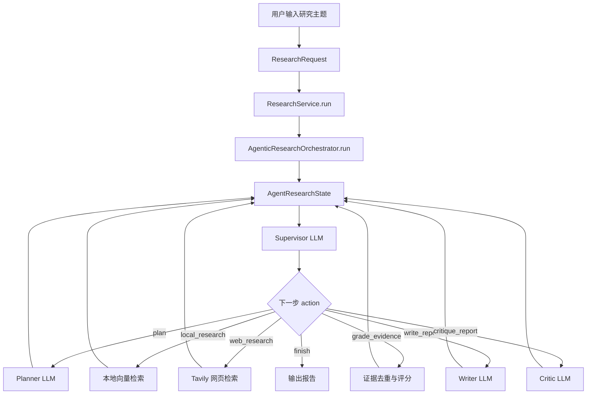
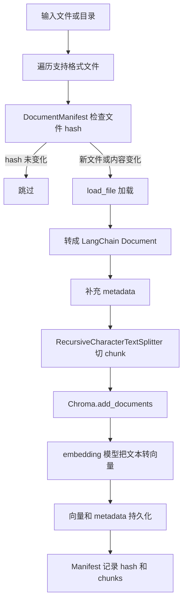

# RAG Multi-Agent 项目信息流与底层原理完整说明

本文档目标：把这个项目从“用户输入一句话”到“系统输出研究报告”的全过程讲清楚。

阅读对象：可以是刚接触 RAG、LangChain、多智能体的小白，也可以是准备面试时需要解释项目底层实现的人。

本文重点回答几个问题：

- 整个项目的数据和信息是怎么流动的？
- 哪些能力是 LangChain 封装好的？
- 哪些能力是项目自己写的？
- 每个 LLM 实际收到的输入长什么样？
- LLM 的输出如何被代码接住、校验、转换和执行？
- RAG、向量库、工具调用、多智能体调度在这个项目里到底怎么工作？
- 如果用一个具体例子跑一遍，内部每一步发生了什么？

## 1. 一句话理解这个项目

这个项目是一个“基于 LangChain 的多智能体 RAG 研究报告生成系统”。

它不是简单的知识库问答：

```text
用户问：LangChain 是什么？
系统答：LangChain 是一个开发 LLM 应用的框架。
```

而是更像一个自动研究助理：

```text
用户给出主题：多智能体 RAG 在企业知识管理中的应用

系统自动做：
1. 拆解研究问题。
2. 生成本地知识库检索词。
3. 生成网页检索词。
4. 查本地向量库。
5. 查公开网页。
6. 把所有资料统一变成 Evidence。
7. 对 Evidence 去重、打分、筛选。
8. 让写作 LLM 基于 Evidence 写报告。
9. 让质检 LLM 检查报告有没有证据不足。
10. 输出报告、证据列表、质检结果和 Agent Trace。
```

核心思想：

```text
不要让 LLM 凭空写报告，而是先检索证据，再让 LLM 基于证据写。
不要让一个 LLM 同时做所有事，而是拆成规划、检索、写作、质检几个角色。
不要完全相信 LLM 的自由输出，而是用 Pydantic、工具调用、状态机和 Guardrails 约束它。
```

## 2. 项目总览

### 2.1 主要入口

项目有三个入口。

| 入口 | 文件 | 作用 |
| --- | --- | --- |
| FastAPI | `api/main.py` | 对外提供 HTTP 接口 |
| CLI | `__main__.py` | 命令行执行入库和研究任务 |
| Streamlit | `ui/streamlit_app.py` | 可视化交互界面 |

这三个入口最后都会调用同一个核心服务：

```python
ResearchService().run(request)
```

也就是说，不管用户从网页界面、命令行还是 API 进来，核心研究逻辑都是同一套。

### 2.2 核心调用链

```text
用户输入
  -> FastAPI / CLI / Streamlit
  -> ResearchRequest
  -> ResearchService
  -> AgenticResearchOrchestrator
  -> Supervisor LLM 决定下一步
  -> Planner / Retriever / Evidence Curator / Writer / Critic
  -> ResearchReport
```

更细一点：



### 2.3 两条主流程

项目有两条主流程：

1. 知识库入库流程：把本地文件变成向量库里的可检索 chunk。
2. 研究报告生成流程：根据用户主题检索证据并生成报告。

二者关系：

```text
入库流程先把文档放进 Chroma 向量库。
研究流程再从 Chroma 向量库里检索相关内容。
```

## 3. 哪些是 LangChain 封装的，哪些是自己写的

这部分很重要。面试时面试官经常问：

```text
你这个项目到底是调了 LangChain 的现成链，还是自己做了编排？
```

答案是：

```text
LangChain 提供底层积木。
项目自己写了业务流程、状态机、多智能体编排、证据治理和 Prompt 拼装。
```

### 3.1 LangChain 封装的部分

| 能力 | 代码位置 | LangChain 提供了什么 |
| --- | --- | --- |
| LLM 调用 | `llm.py` | `ChatOpenAI` 封装 OpenAI-compatible Chat API 调用 |
| 消息格式 | `agents/supervisor.py` | `SystemMessage`、`HumanMessage` 封装聊天消息 |
| 工具调用 | `agents/supervisor.py` | `StructuredTool` 把 Python 函数包装成 LLM 可选择的工具 |
| 文档对象 | `ingestion/loaders.py` | `Document` 统一表示文本和 metadata |
| PDF 加载 | `ingestion/loaders.py` | `PyPDFLoader` 读取 PDF |
| DOCX 加载 | `ingestion/loaders.py` | `Docx2txtLoader` 读取 Word 文档 |
| 文本切分 | `ingestion/chunker.py` | `RecursiveCharacterTextSplitter` 按分隔符递归切 chunk |
| 向量库 | `retrieval/vector_store.py` | `Chroma` 封装向量存储、写入和相似度检索 |
| 网页搜索工具 | `retrieval/web_search.py` | `TavilySearch` 封装 Tavily 搜索接口 |
| Embeddings 接口 | `retrieval/vector_store.py` | `Embeddings` 定义向量模型接口 |

### 3.2 项目自己写的部分

| 能力 | 代码位置 | 自己实现了什么 |
| --- | --- | --- |
| 多智能体主流程 | `agents/supervisor.py` | `AgenticResearchOrchestrator.run()` 循环调度 |
| 状态管理 | `agents/supervisor.py` | `AgentResearchState` 保存 plan、evidence、report、critique、trace |
| Supervisor 决策解析 | `agents/supervisor.py` | 把 tool call 转换为内部 `SupervisorDecision` |
| Guardrails | `agents/supervisor.py` | 防止没证据就写报告、没报告就结束等错误流程 |
| 规则兜底 | `agents/supervisor.py` | LLM 不可用时按固定状态机继续推进 |
| Planner Prompt | `agents/prompts.py` | 规划专家系统提示词 |
| Writer Prompt | `agents/prompts.py` | 证据驱动写作约束 |
| Critic Prompt | `agents/prompts.py` | 事实核查与质量评审约束 |
| Evidence 数据模型 | `models.py` | 统一封装本地和网页证据 |
| 证据去重 | `retrieval/evidence.py` | 按 URL 或标题内容去重 |
| 证据评分 | `retrieval/evidence.py` | 相关性、可信度、时效性加权 |
| Manifest 增量入库 | `storage/manifest.py` | 文件 hash 检测，避免重复入库 |
| JSON 提取 | `utils/json.py` | 从 LLM 输出里提取 JSON |
| API/CLI/UI 业务入口 | `api/`、`__main__.py`、`ui/` | 把核心服务暴露给不同使用方式 |

### 3.3 一个容易混淆的点

`StructuredTool` 是 LangChain 封装的，但“工具真正做什么”是项目自己决定的。

比如：

```python
StructuredTool.from_function(
    name="search_local_knowledge",
    description="检索本地知识库，适合查私有文档、样例资料和已入库知识。",
    func=search_local_knowledge,
    args_schema=ResearchSearchInput,
)
```

LangChain 做的是：

```text
把工具名、描述、参数 schema 暴露给 LLM。
让模型可以返回一个 tool_call。
```

项目自己做的是：

```text
收到 tool_call 后，映射成 action = local_research。
然后执行 retrieve_local(query)。
再把结果写入 state.evidence。
```

所以 LangChain 不会自动帮你做 RAG 研究报告。它只提供基础封装，真正的业务编排是项目自己写的。

## 4. 基础概念：小白先看这一节

### 4.1 什么是 RAG

RAG 是 Retrieval-Augmented Generation，意思是“检索增强生成”。

普通 LLM：

```text
用户问题 -> LLM -> 回答
```

RAG：

```text
用户问题 -> 检索相关资料 -> 把资料和问题一起给 LLM -> 回答
```

为什么要 RAG：

- LLM 参数里的知识可能过时。
- LLM 不知道你的私有文档。
- LLM 容易编造。
- 把检索到的证据给它，可以降低幻觉。

### 4.2 什么是向量检索

计算机不能直接理解一句话的语义，所以要先把文本变成数字向量。

例子：

```text
"多智能体 RAG" -> [0.12, -0.44, 0.98, ...]
"企业知识管理" -> [0.10, -0.40, 0.91, ...]
```

两个向量越接近，说明语义越相似。

向量检索的过程：

```text
1. 文档入库时，把每个 chunk 转成向量，存进向量库。
2. 用户查询时，把查询词也转成向量。
3. 向量库计算查询向量和文档向量的相似度。
4. 返回最相似的几个 chunk。
```

在本项目中：

- 向量库由 `langchain_chroma.Chroma` 封装。
- 文档 chunk 是 `langchain_core.documents.Document`。
- embedding 模型应该由 `get_embeddings()` 返回。

当前代码注意点：

```text
get_embeddings(settings) 函数目前只 import 了 DashScopeEmbeddings，还没有 return 实例。
所以从工程完整性看，向量化工厂函数需要补全后才能稳定端到端运行。
```

### 4.3 什么是 Multi-Agent

这里的 Agent 不是独立进程，而是不同职责的 LLM 角色。

本项目的角色：

| Agent | 做什么 |
| --- | --- |
| Supervisor | 看当前状态，决定下一步 |
| Planner | 把主题拆成研究计划 |
| Local Retriever | 检索本地知识库，不是 LLM |
| Web Retriever | 搜索网页，不是 LLM |
| Evidence Curator | 证据去重评分，不是 LLM |
| Writer | 基于证据写报告 |
| Critic | 检查报告质量 |

这里真正调用 LLM 的是：	

```text
Supervisor
Planner
Writer
Critic
```

不调用 LLM 的是：

```text
本地检索
网页检索
证据去重
证据评分
Manifest hash
Pydantic 校验
```

## 5. 知识库入库流程：文件如何变成可检索知识

入库入口：

```text
CLI: python -m RAG_multiagent ingest data/raw
API: POST /ingest?path=data/raw
UI: Streamlit 侧边栏点击 Ingest documents
```

核心函数：

```python
ingestion.pipeline.ingest_path(path, force=False)
```

### 5.1 入库完整流程图



### 5.2 第一步：遍历支持的文件

代码：

```python
SUPPORTED_SUFFIXES = {".txt", ".md", ".markdown", ".pdf", ".docx", ".html", ".htm"}
```

如果传入的是文件：

```text
判断后缀是否支持，支持就返回一个文件。
```

如果传入的是目录：

```text
递归扫描目录下所有支持格式的文件。
```

这是项目自己写的。

### 5.3 第二步：Manifest 判断是否需要重新入库

代码位置：

```text
storage/manifest.py
```

核心逻辑：

```python
def fingerprint(file_path: Path) -> str:
    h = hashlib.sha1()
    with open(file_path, "rb") as f:
        for block in iter(lambda: f.read(1024 * 1024), b""):
            h.update(block)
    return h.hexdigest()
```

底层原理：

```text
文件内容 -> hash 字符串
```

只要文件内容变了，hash 基本就会变。

例子：

```text
a.txt 内容是：hello
hash = abc123...

a.txt 内容改成：hello world
hash = def456...

系统发现 hash 不一样，就知道文件变过了，需要重新入库。
```

注意：

```text
当前代码用的是 SHA-1。
Manifest JSON 字段名叫 sha256，但实际算法不是 SHA-256。
```

### 5.4 第三步：文件加载成 Document

代码位置：

```text
ingestion/loaders.py
```

不同文件走不同加载器：

| 文件类型 | 使用方式 | 谁提供 |
| --- | --- | --- |
| PDF | `PyPDFLoader(path).load()` | LangChain Community |
| DOCX | `Docx2txtLoader(str(path)).load()` | LangChain Community |
| HTML | `BeautifulSoup(...).get_text(" ")` | 项目自己调用 BeautifulSoup |
| TXT/MD | `path.read_text(...)` | 项目自己读取 |

最后都会变成 `Document`：

```python
Document(
    page_content="文档正文",
    metadata={
        "source": "data/raw/example.md",
        "file_type": ".md"
    }
)
```

`Document` 是 LangChain 提供的统一文档对象。

它有两个核心字段：

```text
page_content: 文本内容
metadata: 元数据，比如文件路径、文件类型、chunk 编号
```

### 5.5 第四步：补充 metadata

入库管道会补充：

```python
doc.metadata.setdefault("source", str(file_path))
doc.metadata.setdefault("filename", file_path.name)
```

这样后续检索到 chunk 时，就知道它来自哪个文件。

### 5.6 第五步：切 chunk

代码位置：

```text
ingestion/chunker.py
```

使用 LangChain 的：

```python
RecursiveCharacterTextSplitter
```

配置：

```python
splitter = RecursiveCharacterTextSplitter(
    chunk_size=int(os.getenv("CHUNK_SIZE")),
    chunk_overlap=int(os.getenv("CHUNK_OVERLAP")),
    separators=["\n\n", "\n", "。", "；", "，", ". ", " ", ""],
)
```

底层原理：

```text
一篇长文档不能整个塞给向量库和 LLM。
所以要切成多个小片段。
```

为什么不用固定长度硬切？

```text
硬切可能把一句话或一个段落切断。
RecursiveCharacterTextSplitter 会优先按段落、换行、句号、逗号、空格切。
只有实在切不开，才按字符切。
```

例子：

```text
原文：
第一段：RAG 是检索增强生成。
第二段：它可以降低幻觉。
第三段：多智能体可以拆分任务。

如果 chunk_size 较小，可能切成：
chunk 0: 第一段 + 第二段
chunk 1: 第二段后半部分 + 第三段
```

`chunk_overlap` 的意义：

```text
相邻 chunk 有重叠内容，避免重要上下文刚好被切断。
```

切完后项目自己补充：

```python
chunk.metadata["chunk_index"] = idx
```

### 5.7 第六步：写入 Chroma 向量库

代码位置：

```text
retrieval/vector_store.py
```

核心代码：

```python
store = Chroma(
    collection_name=os.getenv("RA_COLLECTION_NAME"),
    embedding_function=embeddings,
    persist_directory=str(os.getenv("RA_VECTOR_STORE_PATH")),
)

store.add_documents(documents)
```

LangChain/Chroma 做了什么：

```text
1. 调用 embedding_function，把每个 chunk 的文本变成向量。
2. 把向量、原文 page_content、metadata 写进 Chroma。
3. 持久化到本地目录。
```

项目自己做了什么：

```text
1. 决定哪些文件要入库。
2. 决定如何切 chunk。
3. 决定 metadata 怎么写。
4. 调用 add_documents。
5. 记录入库统计和 Manifest。
```

## 6. 研究报告生成流程：从用户主题到最终报告

核心入口：

```python
ResearchService().run(request)
```

内部：

```python
self.orchestrator = AgenticResearchOrchestrator()
return self.orchestrator.run(request)
```

### 6.1 用户输入如何变成 ResearchRequest

假设用户在 Streamlit 输入：

```text
多智能体 RAG 在企业知识管理中的应用
```

并选择：

```text
Depth: detailed
Format: markdown
Use web search: true
```

代码会构造：

```python
ResearchRequest(
    topic="多智能体 RAG 在企业知识管理中的应用",
    depth=ResearchDepth.detailed,
    report_format=ReportFormat.markdown,
    require_web=True,
)
```

Pydantic 会补默认值：

```json
{
  "topic": "多智能体 RAG 在企业知识管理中的应用",
  "depth": "detailed",
  "report_format": "markdown",
  "language": "zh",
  "require_web": true,
  "allowed_domains": [],
  "blacklist": []
}
```

### 6.2 系统状态 AgentResearchState

研究任务开始时，系统创建：

```python
state = AgentResearchState(request=request)
```

初始状态大概是：

```json
{
  "request": {
    "topic": "多智能体 RAG 在企业知识管理中的应用",
    "depth": "detailed",
    "report_format": "markdown",
    "language": "zh",
    "require_web": true
  },
  "plan": null,
  "evidence": [],
  "graded_evidence": [],
  "report": null,
  "critique": null,
  "errors": [],
  "trace": []
}
```

后续所有 Agent 都围绕这个 state 读写。

可以把 state 理解成“项目的工作台”：

```text
Planner 把研究计划放到工作台。
Retriever 把证据放到工作台。
Curator 把证据整理后放回工作台。
Writer 从工作台拿计划和证据写报告。
Critic 从工作台拿报告和证据做质检。
Supervisor 每轮看工作台，决定下一步干什么。
```

### 6.3 主循环

代码：

```python
for step in range(1, 10):
    decision = self._choose_next_tool(state, step)
    decision = self._apply_safety_guardrails(state, decision)
    self._record_decision(state, step, decision)

    if decision.action == "finish":
        break

    self._execute_decision(state, decision, step)
```

解释：

```text
最多跑 9 轮。
每一轮先问 Supervisor：下一步做什么？
然后用 Guardrails 修正不合理动作。
再执行对应动作。
```

如果 9 轮后还没有报告：

```python
self._force_minimum_report(state, 10)
```

系统会强制生成一份最低可用报告。

## 7. Supervisor LLM：它收到什么，输出什么

Supervisor 是整个系统的大脑。

它不直接写报告，也不直接检索。

它只做一件事：

```text
看当前状态，决定下一步调用哪个工具。
```

### 7.1 Supervisor 的 SystemMessage

代码里的 `SUPERVISOR_SYSTEM`：

```text
你是一个研究型多智能体系统的主管智能体。
你必须通过工具调用来调度专家能力；每一轮只调用一个最合适的工具。

可用工具：
- plan_research：让规划专家生成或重做研究计划。
- search_local_knowledge：让本地 RAG 专家检索私有知识库。
- search_web：让网页研究专家检索公开互联网资料；只有用户允许网页搜索时使用。
- curate_evidence：让证据策展专家去重、评分、筛选证据。
- write_or_revise_report：让写作专家基于证据撰写或重写报告。
- critique_report：让质检专家检查报告证据覆盖、缺口和 unsupported claims。
- finish_research：当报告已经足够好时结束。

调度原则：
1. 不要机械执行固定流水线；你要根据当前状态选择下一步工具。
2. 没有计划时通常调用 plan_research。
3. 证据不足时调用 search_local_knowledge；如果用户允许且主题需要时效性，再调用 search_web。
4. 有新证据后通常调用 curate_evidence，再考虑写作。
5. 有报告后应调用 critique_report；质检发现缺口时继续检索或重写。
6. 只有当报告存在、证据充分、质检通过或缺口可接受时才调用 finish_research。
7. 工具参数要具体，特别是检索 queries 和重写 revision_instructions。
```

SystemMessage 的作用：

```text
告诉 LLM 它现在扮演什么角色，有哪些工具，应该遵守什么规则。
```

### 7.2 Supervisor 的 HumanMessage 实际长什么样

代码会拼出：

```python
prompt = f"""请观察当前状态，并调用一个最合适的工具推进研究任务。
用户请求：
{state.request.model_dump_json(indent=2)}

当前步数：{step}/{10}

状态摘要：
{self._state_summary(state)}

如果当前模型无法使用工具调用，请仅返回 JSON：
{{
  "action": "plan | local_research | web_research | grade_evidence | write_report | critique_report | finish",
  "rationale": "为什么选择这一步",
  "queries": ["如需检索，给出具体查询词"],
  "revision_instructions": "如需重写报告，给出修改要求",
  "confidence": 0.0
}}
"""
```

第一轮时，HumanMessage 可能是：

```text
请观察当前状态，并调用一个最合适的工具推进研究任务。
用户请求：
{
  "topic": "多智能体 RAG 在企业知识管理中的应用",
  "depth": "detailed",
  "report_format": "markdown",
  "language": "zh",
  "require_web": true,
  "allowed_domains": [],
  "blacklist": []
}

当前步数：1/10

状态摘要：
{
  "has_plan": false,
  "plan": null,
  "evidence_count": 0,
  "graded_evidence_count": 0,
  "evidence_preview": [],
  "report": null,
  "critique": null,
  "errors": [],
  "recent_trace": []
}

如果当前模型无法使用工具调用，请仅返回 JSON：
{
  "action": "plan | local_research | web_research | grade_evidence | write_report | critique_report | finish",
  "rationale": "为什么选择这一步",
  "queries": ["如需检索，给出具体查询词"],
  "revision_instructions": "如需重写报告，给出修改要求",
  "confidence": 0.0
}
```

这就是 LLM 实际看到的信息。

它看不到完整代码。

它只看到：

```text
系统角色说明 + 当前任务 JSON + 当前状态摘要 + 可选 JSON 格式
```

### 7.3 Supervisor 的工具是怎么给 LLM 的

项目用：

```python
model_with_tools = llm.bind_tools(self.supervisor_tools, tool_choice="auto")
```

这里 `bind_tools` 是 LangChain 封装。

底层含义：

```text
把工具名、工具描述、参数 JSON Schema 一起传给模型。
模型可以选择输出普通文本，也可以输出 tool_calls。
```

例如工具：

```python
class ResearchSearchInput(BaseModel):
    queries: list[str]
    rationale: str
    confidence: float
```

会被转成类似这样的工具参数说明：

```json
{
  "name": "search_local_knowledge",
  "description": "检索本地知识库，适合查私有文档、样例资料和已入库知识。",
  "parameters": {
    "type": "object",
    "properties": {
      "queries": {
        "type": "array",
        "items": {"type": "string"},
        "description": "具体、可检索的查询词列表。"
      },
      "rationale": {
        "type": "string",
        "description": "为什么需要这轮检索。"
      },
      "confidence": {
        "type": "number",
        "minimum": 0.0,
        "maximum": 1.0
      }
    }
  }
}
```

### 7.4 Supervisor 输出可能是什么

第一轮通常会输出工具调用：

```json
{
  "name": "plan_research",
  "args": {
    "rationale": "当前还没有研究计划，需要先拆解主题、生成研究问题和检索词。",
    "confidence": 0.92
  }
}
```

LangChain 会把这个放进 `response.tool_calls`。

项目再执行：

```python
return self._decision_from_tool_call(tool_calls[0])
```

转成内部决策：

```json
{
  "action": "plan",
  "rationale": "当前还没有研究计划，需要先拆解主题、生成研究问题和检索词。",
  "queries": [],
  "revision_instructions": "",
  "confidence": 0.92,
  "source": "tool_call"
}
```

注意：

```text
LLM 只是说“我想调用 plan_research”。
真正执行 Planner 的，是 Python 代码里的 _execute_decision。
```

### 7.5 如果工具调用失败怎么办

代码有三层兜底：

第一层：工具调用。

```python
tool_calls = getattr(response, "tool_calls", None) or []
```

第二层：JSON 输出。

```python
data = extract_json_object(str(response.content))
SupervisorDecision.model_validate(data)
```

第三层：规则状态机。

```python
return self._fallback_decision(state)
```

规则状态机逻辑：

```text
没有 plan -> plan
没有 evidence -> local_research
有 evidence 但没筛选 -> grade_evidence
有筛选证据但没 report -> write_report
有 report 但没 critique -> critique_report
critique passed -> finish
critique 不通过 -> local_research
```

所以即使 LLM 输出不稳定，系统也尽量能继续跑。

## 8. Planner LLM：它收到什么，输出什么

Planner 的作用：

```text
把用户主题拆成研究问题、检索词和报告章节。
```

### 8.1 Planner 的 SystemMessage

来自 `PLANNER_SYSTEM`：

```text
你是研究规划专家。你的任务是把用户主题拆成可检索、可验证、可交付的研究计划。

要求：
- 必须围绕用户主题生成具体、可执行的研究问题，不要泛泛而谈。
- research_questions 应覆盖：背景定义、关键事实、方法/案例、风险限制、趋势或建议。
- local_queries 面向本地知识库，适合检索内部文档、样例资料、历史知识。
- web_queries 面向公开互联网，适合检索最新资料、行业报告、政策、论文或新闻。
- 如果主题涉及医疗、法律、金融、安全、政策、实时事件，必须写入 risk_notes。
- 查询词要具体，避免只有一个宽泛关键词。
- 只返回 JSON，不要输出 Markdown 或解释文字。
```

### 8.2 Planner 的 HumanMessage 实际长什么样

代码：

```python
prompt = f"""请为下面研究任务生成 JSON 研究计划。
主题：{request.topic}
深度：{request.depth.value}
报告格式：{request.report_format.value}
语言：{request.language}

JSON schema:
{{
  "title": "string",
  "intent": "string",
  "research_questions": ["string"],
  "local_queries": ["string"],
  "web_queries": ["string"],
  "expected_sections": ["string"],
  "risk_notes": ["string"]
}}
"""
```

具体例子：

```text
请为下面研究任务生成 JSON 研究计划。
主题：多智能体 RAG 在企业知识管理中的应用
深度：detailed
报告格式：markdown
语言：zh

JSON schema:
{
  "title": "string",
  "intent": "string",
  "research_questions": ["string"],
  "local_queries": ["string"],
  "web_queries": ["string"],
  "expected_sections": ["string"],
  "risk_notes": ["string"]
}
```

### 8.3 Planner 应该输出什么

可能输出：

```json
{
  "title": "多智能体 RAG 在企业知识管理中的应用研究报告",
  "intent": "分析多智能体 RAG 如何用于企业知识管理，包括技术架构、典型场景、优势、风险与落地建议。",
  "research_questions": [
    "多智能体 RAG 的核心概念和系统边界是什么？",
    "企业知识管理中常见的信息检索、知识沉淀和问答痛点有哪些？",
    "多智能体 RAG 可以通过哪些角色分工提升知识检索和报告生成效果？",
    "落地时需要关注哪些数据安全、权限控制、幻觉和评估问题？"
  ],
  "local_queries": [
    "企业知识管理 RAG 架构",
    "多智能体 RAG 私有知识库",
    "知识库问答 证据引用 质量评估"
  ],
  "web_queries": [
    "multi agent RAG enterprise knowledge management",
    "RAG evaluation hallucination citation grounding",
    "enterprise knowledge management retrieval augmented generation"
  ],
  "expected_sections": [
    "执行摘要",
    "背景与概念",
    "技术架构",
    "应用场景",
    "风险与限制",
    "落地建议",
    "参考证据"
  ],
  "risk_notes": [
    "涉及企业私有数据时需要关注权限控制、数据脱敏和审计。"
  ]
}
```

### 8.4 Planner 输出如何被代码接住

代码：

```python
response = llm.invoke([SystemMessage(...), HumanMessage(...)])
data = extract_json_object(str(response.content))
state.plan = QueryPlan.model_validate(data)
```

底层过程：

```text
LLM 输出文本
  -> extract_json_object 从文本中提取 JSON
  -> Pydantic 校验 JSON 是否符合 QueryPlan
  -> 校验成功后放入 state.plan
```

如果失败：

```python
state.plan = self._fallback_plan(request)
```

兜底计划会根据 topic 生成默认研究问题和检索词。

## 9. 本地检索：不调用 LLM，走向量库

当 Supervisor 决定：

```json
{"action": "local_research"}
```

执行：

```python
self._run_local_research_agent(state, decision.queries, step)
```

### 9.1 输入是什么

输入是查询词列表，例如：

```python
[
  "企业知识管理 RAG 架构",
  "多智能体 RAG 私有知识库",
  "知识库问答 证据引用 质量评估"
]
```

这些查询词可能来自：

```text
1. Supervisor tool call 直接给出。
2. Planner 生成的 local_queries。
3. Critic 生成的 next_queries。
4. fallback 默认用 topic。
```

### 9.2 检索流程

代码：

```python
docs = similarity_search(query, k=k or os.getenv("RA_RETRIEVAL_K"))
```

`similarity_search` 内部：

```python
store = get_vector_store()
return store.similarity_search(query, k=k or os.getenv("RA_RETRIEVAL_K"))
```

LangChain/Chroma 做了：

```text
1. 把 query 转成 query embedding。
2. 和向量库里的 chunk embedding 计算相似度。
3. 返回最相似的 k 个 Document。
```

项目自己做了：

```text
1. 选择 query。
2. 调用 similarity_search。
3. 把返回的 Document 转成 Evidence。
4. 生成本地证据 ID。
5. 写入 state.evidence。
```

### 9.3 Document 如何变成 Evidence

代码：

```python
Evidence(
    id=f"L{abs(hash((query, source, idx, doc.page_content[:60]))) % 10_000_000}",
    source_type=SourceType.local,
    title=title,
    content=doc.page_content,
    source=source,
    score=max(0.4, 1.0 - idx * 0.6),
    metadata=dict(doc.metadata) | {"query": query},
)
```

例子：

```json
{
  "id": "L3819201",
  "source_type": "local",
  "title": "enterprise_rag_notes.md",
  "content": "企业知识管理系统通常需要解决知识分散、搜索效率低和回答不可追溯等问题...",
  "url": null,
  "source": "data/raw/enterprise_rag_notes.md",
  "score": 1.0,
  "metadata": {
    "source": "data/raw/enterprise_rag_notes.md",
    "filename": "enterprise_rag_notes.md",
    "chunk_index": 3,
    "query": "企业知识管理 RAG 架构"
  }
}
```

注意：

```text
本地检索不是 LLM 在读所有文件。
而是 Chroma 根据向量相似度返回相关 chunk。
LLM 只有在 Writer 阶段才看到筛选后的 evidence excerpt。
```

## 10. 网页检索：也不直接调用通用 LLM

当 Supervisor 决定：

```json
{"action": "web_research"}
```

执行：

```python
self._run_web_research_agent(state, decision.queries, step)
```

### 10.1 输入是什么

输入是网页查询词，例如：

```python
[
  "multi agent RAG enterprise knowledge management",
  "RAG evaluation hallucination citation grounding",
  "enterprise knowledge management retrieval augmented generation"
]
```

### 10.2 TavilySearch 做了什么

代码：

```python
tool = TavilySearch(max_results=max_results, include_answer=False, include_raw_content=False)
result = tool.invoke({"query": query})
```

LangChain/Tavily 封装了：

```text
1. 调用 Tavily 搜索服务。
2. 返回搜索结果列表。
3. 每条结果通常包含 title、url、content/snippet、score 等字段。
```

项目自己做了：

```text
1. 控制每个 query 最多返回 5 条。
2. 过滤 content 为空的结果。
3. 把搜索结果转成 Evidence。
4. 生成 W 开头的网页证据 ID。
```

### 10.3 网页 Evidence 示例

```json
{
  "id": "W8291304",
  "source_type": "web",
  "title": "Retrieval-Augmented Generation for Enterprise Knowledge",
  "content": "Retrieval augmented generation combines search over external knowledge sources with language model generation...",
  "url": "https://example.org/rag-enterprise",
  "source": null,
  "retrieved_at": "2026-04-28T10:20:00Z",
  "score": 0.78,
  "metadata": {
    "query": "enterprise knowledge management retrieval augmented generation"
  }
}
```

## 11. Evidence Curator：证据如何被去重、评分、筛选

Evidence Curator 不是 LLM。

它是确定性的 Python 代码。

执行：

```python
graded = grade_and_filter(
    state.evidence,
    min_score=self.settings.min_evidence_score,
    limit=self.settings.max_evidence_items,
)
```

### 11.1 为什么要证据治理

检索结果可能有问题：

```text
1. 同一个网页被多个 query 搜到。
2. 同一个本地 chunk 被多个 query 召回。
3. 有些结果相关性高但来源不可信。
4. 有些结果来源可信但时间太旧。
5. Evidence 太多，塞进 LLM prompt 会超长。
```

所以需要：

```text
去重 -> 打分 -> 排序 -> 截断
```

### 11.2 去重逻辑

代码：

```python
key = item.url or f"{item.title}:{item.content[:240]}"
if key not in seen or item.score > seen[key].score:
    seen[key] = item
```

解释：

```text
如果有 URL，用 URL 判断是不是同一条证据。
如果没有 URL，用标题 + 前 240 个字符判断。
重复时保留 score 更高的。
```

### 11.3 可信度评分

代码：

```python
if item.source_type == SourceType.local:
    return 0.82
if not item.url:
    return 0.45
if host.endswith((".edu", ".gov", ".org")):
    return 0.86
if any(domain in host for domain in ["arxiv.org", "nature.com", "science.org", "acm.org", "ieee.org"]):
    return 0.9
return 0.62
```

解释：

```text
本地知识库默认可信度较高。
学术、政府、教育、论文网站可信度更高。
普通网页可信度中等。
没有 URL 的网页结果可信度较低。
```

### 11.4 时效性评分

代码：

```python
if not item.published_at:
    return 0.55
year = int(item.published_at[:4])
age = current_year - year
return max(0.25, 1.0 - age * 0.08)
```

解释：

```text
越新的资料 freshness 越高。
没有发布时间时给默认 0.55。
```

### 11.5 最终分数

代码：

```python
final_score = relevance * 0.5 + credibility * 0.3 + freshness * 0.2
```

含义：

| 维度 | 权重 | 含义 |
| --- | --- | --- |
| relevance | 0.5 | 和用户主题是否相关 |
| credibility | 0.3 | 来源是否可信 |
| freshness | 0.2 | 信息是否新 |

例子：

```text
某条本地证据：
relevance = 0.90
credibility = 0.82
freshness = 0.55

final_score = 0.90 * 0.5 + 0.82 * 0.3 + 0.55 * 0.2
            = 0.45 + 0.246 + 0.11
            = 0.806
```

如果 `min_evidence_score = 0.35`，这条证据会被保留。

## 12. Writer LLM：它收到什么，如何写报告

Writer 是真正生成报告正文的 LLM。

它看到的信息主要是：

```text
研究任务 + 研究意图 + 研究问题 + 期望章节 + 报告格式 + 语言 + 可用证据 + 质检反馈 + 写作要求
```

### 12.1 Writer 的 SystemMessage

来自 `WRITER_SYSTEM`：

```text
你是严谨的证据驱动型研究报告作者。你只能使用给定 evidence block 写作。

硬性规则：
- 每个实质性事实、数字、趋势、对比、因果判断、建议都必须带证据编号，如 [L123] 或 [W456]。
- 只能引用 evidence block 中真实存在的证据 ID，禁止编造引用 ID。
- 没有证据支持的内容必须明确写成“证据不足，无法判断”。
- 如果证据之间存在冲突，必须说明冲突，并标注对应证据 ID。
- 不要捏造论文、作者、机构、URL、日期、统计数据。
- 建议部分必须能追溯到前文证据。
- 输出 Markdown。
- 报告应包含：执行摘要、关键发现、证据分析、风险与限制、建议、参考证据清单。
```

### 12.2 Writer 的 HumanMessage 模板

代码：

```python
prompt = f"""研究任务：{state.request.topic}
研究意图：{state.plan.intent}
研究问题：
{chr(10).join(f"- {question}" for question in state.plan.research_questions)}

期望章节：{", ".join(state.plan.expected_sections)}
报告格式：{state.request.report_format.value}
语言：{state.request.language}

可用证据：
{evidence_block if evidence_block else "暂无可用证据"}

上一轮质检反馈：
{critique_block}

主管给出的写作或修改要求：
{revision_instructions or "首次成稿，严格基于证据写作。"}

请写出专业、可执行、证据驱动的 Markdown 报告。每个实质性事实、数字、趋势、因果判断都必须带证据编号。
"""
```

### 12.3 Writer 实际收到的信息示例

假设已经有计划和两条证据，Writer 可能收到：

```text
研究任务：多智能体 RAG 在企业知识管理中的应用
研究意图：分析多智能体 RAG 如何用于企业知识管理，包括技术架构、典型场景、优势、风险与落地建议。
研究问题：
- 多智能体 RAG 的核心概念和系统边界是什么？
- 企业知识管理中常见的信息检索、知识沉淀和问答痛点有哪些？
- 多智能体 RAG 可以通过哪些角色分工提升知识检索和报告生成效果？
- 落地时需要关注哪些数据安全、权限控制、幻觉和评估问题？

期望章节：执行摘要, 背景与概念, 技术架构, 应用场景, 风险与限制, 落地建议, 参考证据
报告格式：markdown
语言：zh

可用证据：
source_type=local; source=data/raw/enterprise_rag_notes.md; score=0.81
excerpt: 企业知识管理系统通常需要解决知识分散、搜索效率低、知识更新不及时和回答不可追溯等问题。RAG 可以通过检索私有知识库为大模型提供上下文...

source_type=web; source=https://example.org/rag-enterprise; score=0.74
excerpt: Retrieval augmented generation combines search over external knowledge sources with language model generation. It is commonly used to ground responses in enterprise data...

上一轮质检反馈：
暂无质检反馈

主管给出的写作或修改要求：
首次成稿，严格基于证据写作。

请写出专业、可执行、证据驱动的 Markdown 报告。每个实质性事实、数字、趋势、因果判断都必须带证据编号。
```

### 12.4 一个当前实现中的关键细节

Writer SystemMessage 要求引用证据编号：

```text
如 [L123] 或 [W456]
```

但是当前 `format_evidence_for_prompt()` 输出的是：

```python
row = (
    f"source_type={item.source_type.value}; source={item.source or item.url or 'unknown'}; "
    f"score={item.score:.2f}\n"
    f"excerpt: {item.content[:1400]}"
)
```

它没有把：

```python
item.id
```

写进 evidence block。

这意味着：

```text
数据结构里有 Evidence.id。
Critic 和 Claim 抽取也围绕 Evidence.id 设计。
但 Writer 当前实际看到的 evidence block 里没有 id。
```

所以严格来说，当前版本的引用链路还差一步：

```python
row = (
    f"id={item.id}; source_type={item.source_type.value}; "
    f"source={item.source or item.url or 'unknown'}; score={item.score:.2f}\n"
    f"excerpt: {item.content[:1400]}"
)
```

面试或讲项目时可以这样说：

```text
项目设计上已经把 Evidence ID、Claim 抽取、Critic 引用检查都建好了。
当前实现需要在 evidence prompt 中补充 id 字段，才能让 Writer 稳定地产生可校验引用。
```

这是一个工程边界，不要夸大成“引用 100% 已闭环”。

### 12.5 Writer 输出后系统做什么

Writer 输出 Markdown，例如：

```markdown
# 多智能体 RAG 在企业知识管理中的应用研究报告

## 执行摘要

企业知识管理常见问题包括知识分散、检索效率低和回答不可追溯。多智能体 RAG 可以通过规划、检索、证据筛选、写作和质检等角色拆分提升流程可控性。
```

代码会构造：

```python
ResearchReport(
    title=state.plan.title,
    executive_summary=self._first_paragraph(report_md),
    report_markdown=report_md,
    claims=claims,
    evidence=state.evidence,
    critique=state.critique,
    agent_trace=state.trace,
)
```

并抽取 claims：

```python
claims = self._extract_claims(report_md, state.evidence)
```

Claim 抽取原理：

```text
逐行扫描报告。
如果某一行足够长，并且包含 [EvidenceID]，就认为它是一条可检查结论。
```

## 13. Critic LLM：它如何检查报告

Critic 的作用：

```text
检查报告是否回答研究问题，是否有证据支撑，是否需要继续检索或重写。
```

### 13.1 Critic 的 SystemMessage

来自 `CRITIC_SYSTEM`：

```text
你是事实核查与质量评审专家。你的任务是检查报告是否真正被证据支撑。

检查重点：
- 是否回答了研究计划中的关键问题。
- 关键事实、数字、趋势、因果判断是否都有证据编号。
- 是否引用了不存在的证据 ID。
- 是否存在没有证据支撑的结论。
- 是否遗漏重要研究问题。
- 是否需要继续本地检索、网页检索或重写报告。

只返回 JSON，格式如下：
{
  "passed": true,
  "quality_score": 0.0,
  "missing_evidence": ["缺少哪些证据"],
  "unsupported_claims": ["哪些结论证据不足"],
  "next_queries": ["如果需要继续检索，给出具体查询词"],
  "notes": "简要说明"
}
```

### 13.2 Critic 的 HumanMessage 模板

代码：

```python
prompt = f"""请检查报告质量，并返回 JSON。
研究问题：{json.dumps(state.plan.research_questions, ensure_ascii=False)}
证据 ID：{sorted(evidence_ids)}
已识别引用 ID：{sorted(cited_ids)}
启发式参考分：{heuristic_score}

报告：
{state.report.report_markdown[:6000]}

返回 JSON：
{{
  "passed": true,
  "quality_score": 0.0,
  "missing_evidence": ["还缺什么证据"],
  "unsupported_claims": ["哪些结论证据不足"],
  "next_queries": ["如果需要继续检索，给出查询词"],
  "notes": "简要质检说明"
}}
"""
```

### 13.3 Critic 实际收到的信息示例

```text
请检查报告质量，并返回 JSON。
研究问题：["多智能体 RAG 的核心概念和系统边界是什么？", "企业知识管理中常见的信息检索、知识沉淀和问答痛点有哪些？", "多智能体 RAG 可以通过哪些角色分工提升知识检索和报告生成效果？", "落地时需要关注哪些数据安全、权限控制、幻觉和评估问题？"]
证据 ID：["L3819201", "W8291304"]
已识别引用 ID：["L3819201"]
启发式参考分：0.62

报告：
# 多智能体 RAG 在企业知识管理中的应用研究报告

## 执行摘要
企业知识管理常见问题包括知识分散、检索效率低和回答不可追溯 [L3819201]。
多智能体 RAG 可以显著提升所有企业的知识管理效率。

返回 JSON：
{
  "passed": true,
  "quality_score": 0.0,
  "missing_evidence": ["还缺什么证据"],
  "unsupported_claims": ["哪些结论证据不足"],
  "next_queries": ["如果需要继续检索，给出查询词"],
  "notes": "简要质检说明"
}
```

Critic 可能返回：

```json
{
  "passed": false,
  "quality_score": 0.58,
  "missing_evidence": [
    "缺少多智能体 RAG 角色分工提升效果的具体证据",
    "缺少数据安全和权限控制方面的证据"
  ],
  "unsupported_claims": [
    "“可以显著提升所有企业的知识管理效率”缺少证据支持，且表述过于绝对"
  ],
  "next_queries": [
    "多智能体 RAG 企业权限控制",
    "RAG citation grounding evaluation enterprise"
  ],
  "notes": "报告有部分证据支撑，但仍存在无证据的泛化结论，需要补充证据或弱化表述。"
}
```

### 13.4 启发式参考分是什么

Critic 之前，代码会先算一个确定性分数：

```python
score = 0.4
if report.evidence:
    score += min(0.25, len(report.evidence) / 40)
if report.claims:
    score += min(0.25, len(cited_ids & evidence_ids) / max(1, len(evidence_ids)))
if len(report.report_markdown) > 1200:
    score += 0.1
```

解释：

```text
基础分 0.4。
证据越多，加一点分。
报告中引用到真实证据 ID，加一点分。
报告长度足够，加一点分。
```

它不是最终真理，只是给 Critic 一个参考，降低 LLM 评分太飘的问题。

## 14. Guardrails：LLM 想乱来时如何被拦住

LLM 可能会做不合理决定。

比如：

```text
没有报告时就 finish。
没有证据时就 write_report。
用户关闭网页搜索时还 web_research。
想检索但不给 queries。
```

项目用 `_apply_safety_guardrails()` 修正。

### 14.1 没有报告不能结束

代码逻辑：

```python
if decision.action == "finish" and state.report is None:
    action = "write_report" if state.plan else "plan"
```

意思：

```text
Supervisor 想结束，但没有报告。
如果已有计划，就先写报告。
如果连计划都没有，就先规划。
```

### 14.2 用户关闭网页搜索时不能搜网页

代码逻辑：

```python
if decision.action == "web_research" and not state.request.require_web:
    action = "local_research"
```

意思：

```text
用户不允许联网，就改成本地检索。
```

### 14.3 检索必须有 query

代码逻辑：

```python
if decision.action in {"local_research", "web_research"} and not decision.queries:
    queries = self._default_queries_for_research(state, decision.action)
```

默认 query 来源优先级：

```text
Critic.next_queries
  -> Plan.web_queries 或 Plan.local_queries
  -> 用户 topic
```

### 14.4 没有证据不能筛选或写作

代码逻辑：

```python
if decision.action in {"grade_evidence", "write_report"} and not state.evidence:
    action = "local_research"
```

意思：

```text
报告必须基于证据，没证据就先检索。
```

### 14.5 没有报告不能质检

代码逻辑：

```python
if decision.action == "critique_report" and state.report is None:
    action = "write_report"
```

意思：

```text
质检对象不存在，就先写报告。
```

## 15. 完整例子：一次任务从头到尾怎么走

假设用户输入：

```text
多智能体 RAG 在企业知识管理中的应用
```

### 15.1 第 1 轮：Supervisor 选择规划

当前状态：

```json
{
  "has_plan": false,
  "evidence_count": 0,
  "report": null
}
```

Supervisor 输出：

```json
{
  "name": "plan_research",
  "args": {
    "rationale": "当前缺少研究计划，需要先拆解研究问题和检索词。",
    "confidence": 0.93
  }
}
```

项目转换：

```json
{
  "action": "plan",
  "source": "tool_call"
}
```

执行：

```text
调用 Planner LLM。
生成 QueryPlan。
写入 state.plan。
记录 trace。
```

### 15.2 第 2 轮：Supervisor 选择本地检索

当前状态：

```json
{
  "has_plan": true,
  "evidence_count": 0,
  "plan": {
    "local_queries": [
      "企业知识管理 RAG 架构",
      "多智能体 RAG 私有知识库",
      "知识库问答 证据引用 质量评估"
    ]
  }
}
```

Supervisor 输出：

```json
{
  "name": "search_local_knowledge",
  "args": {
    "queries": [
      "企业知识管理 RAG 架构",
      "多智能体 RAG 私有知识库",
      "知识库问答 证据引用 质量评估"
    ],
    "rationale": "需要先检索私有知识库，获取内部资料和历史知识。",
    "confidence": 0.88
  }
}
```

执行：

```text
对每个 query 调 Chroma.similarity_search。
Document -> Evidence。
新增到 state.evidence。
```

### 15.3 第 3 轮：Supervisor 选择网页检索

如果用户允许网页检索：

```json
{
  "require_web": true
}
```

Supervisor 可能输出：

```json
{
  "name": "search_web",
  "args": {
    "queries": [
      "multi agent RAG enterprise knowledge management",
      "RAG citation grounding evaluation enterprise"
    ],
    "rationale": "主题涉及较新的 RAG 应用，需要补充公开资料。",
    "confidence": 0.81
  }
}
```

执行：

```text
调用 TavilySearch。
搜索结果 -> Web Evidence。
新增到 state.evidence。
```

如果用户设置 `require_web=false`：

```text
Guardrails 会把 web_research 改成 local_research。
```

### 15.4 第 4 轮：Supervisor 选择证据筛选

当前状态：

```json
{
  "evidence_count": 16,
  "graded_evidence_count": 0
}
```

Supervisor 输出：

```json
{
  "name": "curate_evidence",
  "args": {
    "rationale": "已有多条本地和网页证据，需要去重、评分并筛选最可靠内容。",
    "confidence": 0.9
  }
}
```

执行：

```text
deduplicate_evidence
  -> credibility_score
  -> freshness_score
  -> final_score
  -> 按分数排序
  -> 截断到 max_evidence_items
```

结果：

```json
{
  "graded_evidence_count": 10,
  "evidence_count": 10
}
```

### 15.5 第 5 轮：Supervisor 选择写报告

当前状态：

```json
{
  "has_plan": true,
  "evidence_count": 10,
  "graded_evidence_count": 10,
  "report": null
}
```

Supervisor 输出：

```json
{
  "name": "write_or_revise_report",
  "args": {
    "revision_instructions": "首次成稿，严格围绕研究问题组织章节，所有结论必须基于证据。",
    "rationale": "已有筛选证据，可以生成初版研究报告。",
    "confidence": 0.86
  }
}
```

执行：

```text
拼 Writer prompt。
调用 Writer LLM。
得到 Markdown。
抽取 claims。
构造 ResearchReport。
```

### 15.6 第 6 轮：Supervisor 选择质检

当前状态：

```json
{
  "report": {
    "title": "多智能体 RAG 在企业知识管理中的应用研究报告",
    "chars": 3500,
    "claims": 4,
    "has_critique": false
  }
}
```

Supervisor 输出：

```json
{
  "name": "critique_report",
  "args": {
    "rationale": "已有初版报告，需要检查证据覆盖和无支撑结论。",
    "confidence": 0.87
  }
}
```

执行：

```text
拼 Critic prompt。
调用 Critic LLM。
得到 Critique。
写入 state.critique 和 report.critique。
```

### 15.7 第 7 轮：两种可能

如果 Critic 通过：

```json
{
  "passed": true,
  "quality_score": 0.84
}
```

Supervisor 选择：

```json
{
  "name": "finish_research",
  "args": {
    "rationale": "质检通过，报告可以交付。",
    "confidence": 0.9
  }
}
```

最终输出 `ResearchReport`。

如果 Critic 不通过：

```json
{
  "passed": false,
  "quality_score": 0.58,
  "next_queries": [
    "多智能体 RAG 企业权限控制",
    "RAG 引用校验 证据追踪"
  ]
}
```

Supervisor 可能选择：

```text
继续 local_research 或 web_research。
然后再 grade_evidence。
然后 write_report 重写。
然后 critique_report 再质检。
```

## 16. Agent Trace：系统如何记录每一步

每次 Supervisor 决策都会记录：

```json
{
  "step": 2,
  "agent": "supervisor",
  "action": "local_research",
  "source": "tool_call",
  "rationale": "需要先检索私有知识库。",
  "queries": ["企业知识管理 RAG 架构"],
  "revision_instructions": "",
  "confidence": 0.88
}
```

每次专家执行后也会记录 observation：

```json
{
  "step": 2,
  "agent": "local_researcher",
  "observation": "本地检索新增 6 条证据。"
}
```

Trace 的作用：

```text
1. 用户可以看到系统为什么这样做。
2. 开发者可以调试流程卡在哪里。
3. 面试时可以说明项目不是黑盒生成，而是有过程可观测性。
```

## 17. API、CLI、UI 的信息流

### 17.1 FastAPI

`api/main.py`：

```python
@app.post("/research", response_model=ResearchReport)
def research(request: ResearchRequest):
    return ResearchService().run(request)
```

请求：

```json
{
  "topic": "多智能体 RAG 在企业知识管理中的应用",
  "depth": "detailed",
  "report_format": "markdown",
  "language": "zh",
  "require_web": true
}
```

响应：

```json
{
  "title": "...",
  "executive_summary": "...",
  "report_markdown": "...",
  "claims": [],
  "evidence": [],
  "agent_trace": [],
  "critique": {},
  "generated_at": "..."
}
```

FastAPI 做了什么：

```text
1. 接收 JSON。
2. 用 Pydantic 转成 ResearchRequest。
3. 调 ResearchService。
4. 把 ResearchReport 序列化为 JSON。
```

### 17.2 CLI

`__main__.py`：

```text
python -m RAG_multiagent config
python -m RAG_multiagent ingest data/raw
python -m RAG_multiagent ask "多智能体 RAG 在企业知识管理中的应用" --depth detailed --format markdown
```

CLI 做了什么：

```text
把命令行参数转成 ResearchRequest，再调用同一个 ResearchService。
```

### 17.3 Streamlit

`ui/streamlit_app.py`：

```text
侧边栏：
- 入库目录
- 是否强制重新索引
- 研究深度
- 报告格式
- 是否使用网页搜索

主区域：
- 输入研究主题
- 点击 Run research
- 展示报告、Evidence、Critique、Agent Trace
```

Streamlit 做了什么：

```text
提供可视化表单，不改变核心业务逻辑。
```

## 18. LLM 被限制的完整链路

这个项目不是只靠一句 prompt 限制 LLM。

它有多层限制。

### 18.1 角色提示词限制

不同 LLM 角色有不同 SystemMessage：

```text
Supervisor: 只能选择工具推进流程。
Planner: 只返回 JSON 研究计划。
Writer: 只能基于 evidence block 写报告。
Critic: 只返回 JSON 质检结果。
```

### 18.2 工具调用限制

Supervisor 不能自由发明 action。

它只能从这些工具里选：

```text
plan_research
search_local_knowledge
search_web
curate_evidence
write_or_revise_report
critique_report
finish_research
```

工具参数还要符合 Pydantic schema。

### 18.3 Pydantic 限制

例如：

```python
confidence: float = Field(default=0.6, ge=0.0, le=1.0)
research_questions: list[str] = Field(min_length=2, max_length=10)
topic: str = Field(min_length=3, max_length=100)
```

作用：

```text
把 LLM 输出变成可校验的数据。
不合格就不能进入下一步。
```

### 18.4 状态机限制

就算 LLM 乱选，Guardrails 也会纠正。

例子：

```text
LLM: finish
代码: 你还没有 report，不能 finish，改成 plan 或 write_report。
```

### 18.5 JSON 提取和 fallback

`extract_json_object()` 做了容错：

```text
如果 LLM 输出 ```json ... ```，就提取里面的 JSON。
如果前后有废话，就截取第一个 { 到最后一个 }。
如果还是解析失败，就返回空 dict。
```

然后代码进入 fallback。

### 18.6 证据数量限制

`format_evidence_for_prompt(items, max_chars=18000)` 限制传给 Writer 的证据总长度。

原因：

```text
LLM 上下文窗口有限。
证据太多会超 token。
所以要按字符预算截断。
```

## 19. 当前实现边界：哪些地方要如实说明

这部分很重要，因为面试官可能会看代码。

### 19.1 `get_embeddings()` 需要补全

当前：

```python
def get_embeddings(settings: Settings):
    from langchain_community.embeddings import DashScopeEmbeddings
```

没有 return。

影响：

```text
Chroma 初始化时需要 embedding_function。
生产可用版本必须补全这个函数。
```

合理补法：

```python
def get_embeddings(settings: Settings):
    if settings.embedding_provider == "dashscope":
        from langchain_community.embeddings import DashScopeEmbeddings
        return DashScopeEmbeddings(
            model=settings.embedding_model,
            dashscope_api_key=settings.dashscope_api_key.get_secret_value(),
        )
```

具体参数要按实际 DashScopeEmbeddings 版本确认。

### 19.2 Writer 的 evidence block 没有带 Evidence ID

前面已经解释，这是引用链路的关键缺口。

建议修复：

```python
f"id={item.id}; source_type={item.source_type.value}; ..."
```

### 19.3 `citation_label()` 和 Writer 期望格式不完全一致

`models.py`：

```python
def citation_label(self):
    return f"{self.id}"
```

而 Writer prompt 示例希望：

```text
[L123]
```

更一致的写法可以是：

```python
def citation_label(self):
    return f"[{self.id}]"
```

### 19.4 配置读取有混用

项目有 `Settings`：

```python
config.py
```

但一些地方还直接：

```python
os.getenv("CHUNK_SIZE")
os.getenv("RA_RETRIEVAL_K")
os.getenv("RA_VECTOR_STORE_PATH")
```

更稳的方式是统一走 `Settings`。

### 19.5 网页域名限制字段还没有落地

`ResearchRequest` 里有：

```python
allowed_domains
blacklist
```

但 `tavily_search()` 当前没有用它们过滤结果。

如果面试官问：

```text
你怎么限制网页来源？
```

要如实说：

```text
数据模型中预留了字段，当前版本还没完全接入搜索结果过滤。
后续可以在 Evidence 生成前后基于 URL host 做白名单和黑名单过滤。
```

## 20. 从底层看：这个项目为什么比普通 RAG 更完整

普通 RAG 常见流程：

```text
query -> retrieve -> prompt -> answer
```

本项目流程：

```text
query
  -> Planner 拆解
  -> Supervisor 动态调度
  -> local/web 多源检索
  -> Evidence 统一建模
  -> 去重、评分、筛选
  -> Writer 证据驱动写作
  -> Claim 抽取
  -> Critic 质检
  -> 不通过则继续检索或重写
  -> 输出 report + evidence + critique + trace
```

核心增强点：

| 普通 RAG | 本项目 |
| --- | --- |
| 直接拿用户 query 检索 | 先规划多个 research questions 和 queries |
| 通常只查本地向量库 | 支持本地和网页 Evidence 融合 |
| 检索结果直接塞给 LLM | 先去重、评分、截断 |
| 一次生成答案 | 生成后还有 Critic 质检 |
| 过程不可见 | 保留 Agent Trace |
| 依赖 prompt | Prompt + Tool schema + Pydantic + Guardrails + Fallback |

## 21. 一个完整的信息流总结

可以把整个系统想成一条信息加工流水线：

```text
用户主题
  -> ResearchRequest
  -> Supervisor 看到 request + state summary
  -> Planner 看到 topic/depth/format/language
  -> QueryPlan
  -> Local queries / Web queries
  -> Chroma / Tavily
  -> LangChain Document / Search Result
  -> Evidence
  -> 去重、可信度评分、时效性评分
  -> Filtered Evidence
  -> Writer 看到 plan + evidence + critique
  -> Markdown Report
  -> Claim 抽取
  -> Critic 看到 research_questions + evidence_ids + cited_ids + report
  -> Critique
  -> Supervisor 决定 finish 或继续
  -> ResearchReport
```

最终产物不是单纯一段文本，而是：

```json
{
  "title": "报告标题",
  "executive_summary": "摘要",
  "report_markdown": "完整 Markdown 报告",
  "claims": "可追踪结论",
  "evidence": "证据列表",
  "agent_trace": "智能体执行轨迹",
  "critique": "质检结果",
  "generated_at": "生成时间"
}
```

## 22. 面试时的底层讲法

如果面试官让你详细讲，可以按这个顺序：

```text
第一层：入口层
用户可以通过 FastAPI、CLI、Streamlit 提交任务，它们都会构造 ResearchRequest。

第二层：编排层
ResearchService 调 AgenticResearchOrchestrator。Orchestrator 维护 AgentResearchState，每轮让 Supervisor 根据状态选择 action。

第三层：工具层
Supervisor 通过 LangChain StructuredTool 选择 plan、local_search、web_search、curate、write、critique 或 finish。工具调用只是决策，真正执行由 Python 状态机完成。

第四层：RAG 层
本地文档先通过 loader、splitter、embedding、Chroma 入库。检索时 similarity_search 返回 Document，再转成 Evidence。

第五层：证据层
本地和网页结果统一成 Evidence，然后去重、按相关性、可信度和时效性评分。

第六层：生成层
Writer LLM 只看到研究计划和筛选后的 evidence block，被要求所有实质性结论都带证据编号。

第七层：质检层
Critic LLM 看到研究问题、证据 ID、已引用 ID 和报告正文，返回结构化 Critique。如果不通过，Supervisor 继续检索或重写。
```

一句话总结：

```text
我不是简单调 LangChain 的 RetrievalQA，而是用 LangChain 的模型、工具、文档、切分和向量库封装作为底层积木，自己实现了一个带状态、证据治理、工具调度、质量评审和可观测 trace 的多智能体 RAG 工作流。
```

## 23. 建议你真正掌握的几个关键点

如果你要把这个项目放到简历里，至少要能讲清楚：

1. `ResearchRequest -> AgentResearchState -> ResearchReport` 的数据结构变化。
2. Supervisor 每轮拿到的是 state summary，不是完整状态。
3. Tool calling 只是让 LLM 选择工具，工具执行还是 Python 代码做。
4. Planner 的输出为什么必须是 QueryPlan JSON。
5. 本地检索为什么不调用 LLM，而是 Chroma similarity search。
6. Evidence 为什么要统一建模。
7. 证据评分公式为什么这么设计。
8. Writer 收到的 prompt 里到底有什么。
9. Critic 如何判断报告是否缺证据。
10. Guardrails 和 fallback 如何降低 LLM 不稳定性。
11. 哪些是 LangChain 封装，哪些是自己实现。
12. 当前版本还有哪些工程边界，如何修复。

掌握这些点，面试官追问底层时基本可以讲得住。
